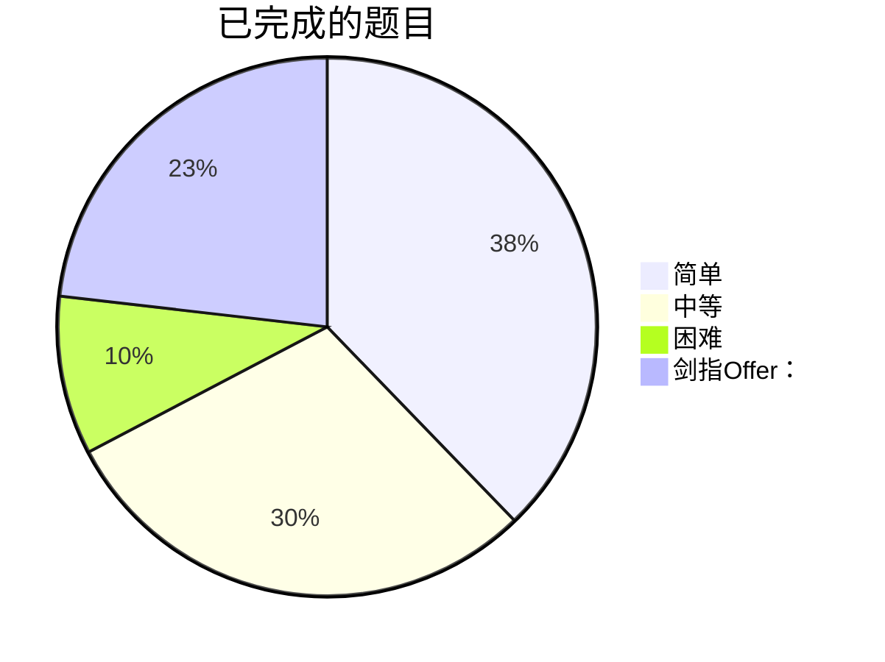

# 刷题记录

some exercises of leetcode

- leetcode：简单：119，中等：93，困难：30，剑指Offer：73,
- 总计：315

| Number | Name | Difficulty | label |
|----|:--:|:------:|:-------:| 
| 1 | [Two Sum 两数之和](https://github.com/kaisa911/LeetCode/blob/master/Thinkings/Easy/1-TwoSum.md) | Easy | |
| 2 | [Add Two Numbers 两数相加](https://github.com/kaisa911/LeetCode/blob/master/Thinkings/Medium/2-AddTwoNumbers.md) | Medium | |
| 3 | [Longest Substring Without Repeating Characters 无重复字符的最长子串](https://github.com/kaisa911/LeetCode/blob/master/Thinkings/Medium/3-LongestSubstringWithoutRepeatingCharacters.md) | Medium | |
| 4 | [Medianof Two Sorted Arrays 两个排序数组的中位数](https://github.com/kaisa911/LeetCode/blob/master/Thinkings/Hard/4-MedianofTwoSortedArrays.md) | Hard | |
| 5 | [Longest Palindromic Substring 最长回文子串](https://github.com/kaisa911/LeetCode/blob/master/Thinkings/Medium/5-LongestPalindromicSubstring.md) | Medium | |
| 6 | [Zig Zag Converesion Z 字形变换](https://github.com/kaisa911/LeetCode/blob/master/Solutions/Medium/6-ZigZagConveresion.js) | Medium | |
| 7 | [Reverse Integer 翻转整数](https://github.com/kaisa911/LeetCode/blob/master/Thinkings/Easy/7-ReverseInteger.md) | Easy | |
| 8 | [Stringto Integer 字符串转为整数](https://github.com/kaisa911/LeetCode/blob/master/Solutions/Medium/8-StringtoInteger.js) | Medium | |
| 9 | [Palindrome Number 回文数字](https://github.com/kaisa911/LeetCode/blob/master/Thinkings/Easy/9-PalindromeNumber.md) | Easy | |
| 10 | [Regular Expression Matching 正则表达式匹配](https://github.com/kaisa911/LeetCode/blob/master/Solutions/Hard/10-RegularExpressionMatching.js) | Hard | |
| 11 | [Container With Most Water 盛最多水的容器](https://github.com/kaisa911/LeetCode/blob/master/Solutions/Medium/11-ContainerWithMostWater.js) | Medium | |
| 12 | [Integerto Roman 整数转罗马数字](https://github.com/kaisa911/LeetCode/blob/master/Solutions/Medium/12-IntegertoRoman.js) | Medium | |
| 13 | [Romanto Integer ](https://github.com/kaisa911/LeetCode/blob/master/Thinkings/Easy/13-RomantoInteger.md) | Easy | |
| 14 | [Longest Common Prefix ](https://github.com/kaisa911/LeetCode/blob/master/Solutions/Easy/14-LongestCommonPrefix.js) | Easy | |
| 15 | [3 Sum ](https://github.com/kaisa911/LeetCode/blob/master/Solutions/Medium/15-3Sum.js) | Medium | |
| 16 | [3 Sum Closest ](https://github.com/kaisa911/LeetCode/blob/master/Solutions/Medium/16-3SumClosest.js) | Medium | |
| 17 | [Letter Combinationsofa Phone Number ](https://github.com/kaisa911/LeetCode/blob/master/Thinkings/Medium/17-LetterCombinationsofaPhoneNumber.md) | Medium | |
| 18 | [4 Sum ](https://github.com/kaisa911/LeetCode/blob/master/Solutions/Medium/18-4Sum.js) | Medium | |
| 19 | [Remove Nth Node From Endof L Ist ](https://github.com/kaisa911/LeetCode/blob/master/Thinkings/Medium/19-RemoveNthNodeFromEndofLIst.md) | Medium | |
| 20 | [Valid Parentheses ](https://github.com/kaisa911/LeetCode/blob/master/Solutions/Easy/20-ValidParentheses.js) | Easy | |
| 21 | [Merge Two Sorted Lists ](https://github.com/kaisa911/LeetCode/blob/master/Thinkings/Easy/21-MergeTwoSortedLists.md) | Easy | |
| 22 | [Generate Parentheses ](https://github.com/kaisa911/LeetCode/blob/master/Thinkings/Medium/22-GenerateParentheses.md) | Medium | |
| 23 | [Mergek Sorted Lists ](https://github.com/kaisa911/LeetCode/blob/master/Thinkings/Hard/23-MergekSortedLists.md) | Hard | |
| 24 | [Swap Nodes In Pairs ](https://github.com/kaisa911/LeetCode/blob/master/Thinkings/Medium/24-SwapNodesInPairs.md) | Medium | |
| 25 | [Reverse Nodes Ink ](https://github.com/kaisa911/LeetCode/blob/master/Solutions/Hard/25-ReverseNodesInk-Group.js) | Hard | |
| 26 | [Remove Duplicatesfrom Sorted Array ](https://github.com/kaisa911/LeetCode/blob/master/Solutions/Easy/26-RemoveDuplicatesfromSortedArray.js) | Easy | |
| 27 | [Remove Element ](https://github.com/kaisa911/LeetCode/blob/master/Solutions/Easy/27-RemoveElement.js) | Easy | |
| 28 | [Implementstr Str ](https://github.com/kaisa911/LeetCode/blob/master/Solutions/Easy/28-ImplementstrStr.js) | Easy | |
| 29 | [Divide Two Integers ](https://github.com/kaisa911/LeetCode/blob/master/Solutions/Medium/29-DivideTwoIntegers.js) | Medium | |
| 30 | [Substringwith Concatenationof All Words ](https://github.com/kaisa911/LeetCode/blob/master/Solutions/Hard/30-SubstringwithConcatenationofAllWords.js) | Hard | |
| 31 | [Next ](https://github.com/kaisa911/LeetCode/blob/master/Solutions/Medium/31-Next-permutation.js) | Medium | |
| 32 | [Longest Valid Parentheses ](https://github.com/kaisa911/LeetCode/blob/master/Solutions/Hard/32-LongestValidParentheses.js) | Hard | |
| 33 | [Searchin Rotated Sorted Array ](https://github.com/kaisa911/LeetCode/blob/master/Solutions/Medium/33-SearchinRotatedSortedArray.js) | Medium | |
| 34 | [Searchfora Range ](https://github.com/kaisa911/LeetCode/blob/master/Solutions/Medium/34-SearchforaRange.js) | Medium | |
| 35 | [Search Insert Position ](https://github.com/kaisa911/LeetCode/blob/master/Solutions/Easy/35-SearchInsertPosition.js) | Easy | |
| 36 | [Valid Sudoku ](https://github.com/kaisa911/LeetCode/blob/master/Solutions/Medium/36-ValidSudoku.js) | Medium | |
| 37 | [Sudoku Solver ](https://github.com/kaisa911/LeetCode/blob/master/Solutions/Hard/37-SudokuSolver.js) | Hard | |
| 38 | [Countand Say ](https://github.com/kaisa911/LeetCode/blob/master/Solutions/Easy/38-CountandSay.js) | Easy | |
| 39 | [Combination Sum ](https://github.com/kaisa911/LeetCode/blob/master/Thinkings/Medium/39-CombinationSum.md) | Medium | |
| 40 | [Combination Sum I I ](https://github.com/kaisa911/LeetCode/blob/master/Solutions/Medium/40-CombinationSumII.js) | Medium | |
| 41 | [First Missing Positive ](https://github.com/kaisa911/LeetCode/blob/master/Solutions/Hard/41-FirstMissingPositive.js) | Hard | |
| 42 | [Trapping Rain Water ](https://github.com/kaisa911/LeetCode/blob/master/Solutions/Hard/42-TrappingRainWater.js) | Hard | |
| 43 | [Maximum Subarray ](https://github.com/kaisa911/LeetCode/blob/master/Solutions/Medium/43-MaximumSubarray.js) | Medium | |
| 44 | [Wildcard Matching ](https://github.com/kaisa911/LeetCode/blob/master/Solutions/Hard/44-WildcardMatching.js) | Hard | |
| 45 | [Jump Game I I ](https://github.com/kaisa911/LeetCode/blob/master/Solutions/Hard/45-JumpGameII.js) | Hard | |
| 46 | [Permutations ](https://github.com/kaisa911/LeetCode/blob/master/Thinkings/Medium/46-Permutations.md) | Medium | |
| 47 | [Permutations I I ](https://github.com/kaisa911/LeetCode/blob/master/Solutions/Medium/47-PermutationsII.js) | Medium | |
| 48 | [Rotate Image ](https://github.com/kaisa911/LeetCode/blob/master/Solutions/Medium/48-RotateImage.js) | Medium | |
| 49 | [Group Anagrams ](https://github.com/kaisa911/LeetCode/blob/master/Solutions/Medium/49-GroupAnagrams.js) | Medium | |
| 50 | [Pow ](https://github.com/kaisa911/LeetCode/blob/master/Solutions/Medium/50-Pow.js) | Medium | |
| 51 | [N Queens ](https://github.com/kaisa911/LeetCode/blob/master/Solutions/Hard/51-NQueens.js) | Hard | |
| 52 | [N Queens I I ](https://github.com/kaisa911/LeetCode/blob/master/Solutions/Hard/52-NQueensII.js) | Hard | |
| 53 | [Multiply String ](https://github.com/kaisa911/LeetCode/blob/master/Solutions/Medium/53-MultiplyString.js) | Medium | |
| 54 | [Spiral Matrix ](https://github.com/kaisa911/LeetCode/blob/master/Solutions/Medium/54-SpiralMatrix.js) | Medium | |
| 55 | [Jump Game ](https://github.com/kaisa911/LeetCode/blob/master/Solutions/Medium/55-JumpGame.js) | Medium | |
| 56 | [Merge Intervals ](https://github.com/kaisa911/LeetCode/blob/master/Solutions/Medium/56-MergeIntervals.js) | Medium | |
| 57 | [Insert Interval ](https://github.com/kaisa911/LeetCode/blob/master/Solutions/Hard/57-InsertInterval.js) | Hard | |
| 58 | [Lengthof Last Word ](https://github.com/kaisa911/LeetCode/blob/master/Solutions/Easy/58-LengthofLastWord.js) | Easy | |
| 59 | [Spiral Matrix I I ](https://github.com/kaisa911/LeetCode/blob/master/Solutions/Medium/59-SpiralMatrixII.js) | Medium | |
| 60 | [Permutation Sequence ](https://github.com/kaisa911/LeetCode/blob/master/Solutions/Medium/60-PermutationSequence.js) | Medium | |
| 61 | [Rotate List ](https://github.com/kaisa911/LeetCode/blob/master/Solutions/Medium/61-RotateList.js) | Medium | |
| 62 | [Unique Paths ](https://github.com/kaisa911/LeetCode/blob/master/Thinkings/Medium/62-UniquePaths.md) | Medium | |
| 63 | [Unique Paths I I ](https://github.com/kaisa911/LeetCode/blob/master/Thinkings/Medium/63-UniquePathsII.md) | Medium | |
| 64 | [Minimum Path Sum ](https://github.com/kaisa911/LeetCode/blob/master/Thinkings/Medium/64-MinimumPathSum.md) | Medium | |
| 65 | [Valid Number ](https://github.com/kaisa911/LeetCode/blob/master/Thinkings/Hard/65-ValidNumber.md) | Hard | |
| 66 | [Plus One ](https://github.com/kaisa911/LeetCode/blob/master/Solutions/Easy/66-PlusOne.js) | Easy | |
| 67 | [Add Binary ](https://github.com/kaisa911/LeetCode/blob/master/Solutions/Easy/67-AddBinary.js) | Easy | |
| 68 | [Text Justification ](https://github.com/kaisa911/LeetCode/blob/master/Thinkings/Hard/68-TextJustification.md) | Hard | |
| 69 | [Sqrt ](https://github.com/kaisa911/LeetCode/blob/master/Solutions/Easy/69-Sqrt.js) | Easy | |
| 70 | [Climbing Stairs ](https://github.com/kaisa911/LeetCode/blob/master/Solutions/Easy/70-ClimbingStairs.js) | Easy | |
| 71 | [Simplify Path ](https://github.com/kaisa911/LeetCode/blob/master/Thinkings/Medium/71-SimplifyPath.md) | Medium | |
| 72 | [Edit Distance ](https://github.com/kaisa911/LeetCode/blob/master/Thinkings/Hard/72-EditDistance.md) | Hard | |
| 73 | [Set Matrix Zeroes ](https://github.com/kaisa911/LeetCode/blob/master/Thinkings/Medium/73-SetMatrixZeroes.md) | Medium | |
| 74 | [Searcha2 D Matrix ](https://github.com/kaisa911/LeetCode/blob/master/Thinkings/Medium/74-Searcha2DMatrix.md) | Medium | |
| 75 | [Sort Colors ](https://github.com/kaisa911/LeetCode/blob/master/Thinkings/Medium/75-SortColors.md) | Medium | |
| 76 | [Minimum Window Substring ](https://github.com/kaisa911/LeetCode/blob/master/Solutions/Hard/76-MinimumWindowSubstring.js) | Hard | |
| 77 | [Combinations ](https://github.com/kaisa911/LeetCode/blob/master/Thinkings/Medium/77-Combinations.md) | Medium | |
| 78 | [Subsets ](https://github.com/kaisa911/LeetCode/blob/master/Thinkings/Medium/78-Subsets.md) | Medium | |
| 79 | [Word Search ](https://github.com/kaisa911/LeetCode/blob/master/Solutions/Medium/79-WordSearch.js) | Medium | |
| 80 | [Remove Duplicatesfrom Sorted Array I I ](https://github.com/kaisa911/LeetCode/blob/master/Thinkings/Medium/80-RemoveDuplicatesfromSortedArrayII.md) | Medium | |
| 81 | [Searching Rotated Sorted Array I I ](https://github.com/kaisa911/LeetCode/blob/master/Solutions/Medium/81-SearchingRotatedSortedArrayII.js) | Medium | |
| 82 | [Remove Duplicate From Sorted List I I ](https://github.com/kaisa911/LeetCode/blob/master/Solutions/Medium/82-RemoveDuplicateFromSortedListII.js) | Medium | |
| 83 | [Remove Duplicatesfrom Sorted List ](https://github.com/kaisa911/LeetCode/blob/master/Solutions/Easy/83-RemoveDuplicatesfromSortedList.js) | Easy | |
| 84 | [Largest Rectanglein Histogram ](https://github.com/kaisa911/LeetCode/blob/master/Solutions/Hard/84-LargestRectangleinHistogram.js) | Hard | |
| 85 | [Maximal Rectangle ](https://github.com/kaisa911/LeetCode/blob/master/Solutions/Hard/85-MaximalRectangle.js) | Hard | |
| 86 | [Partition List ](https://github.com/kaisa911/LeetCode/blob/master/Solutions/Medium/86-PartitionList.js) | Medium | |
| 87 | [Scramble String ](https://github.com/kaisa911/LeetCode/blob/master/Solutions/Hard/87-ScrambleString.js) | Hard | |
| 88 | [Merge Sorted Array ](https://github.com/kaisa911/LeetCode/blob/master/Solutions/Easy/88-MergeSortedArray.js) | Easy | |
| 89 | [Gray Code ](https://github.com/kaisa911/LeetCode/blob/master/Solutions/Medium/89-GrayCode.js) | Medium | |
| 90 | [Subsets I I ](https://github.com/kaisa911/LeetCode/blob/master/Solutions/Medium/90-SubsetsII.js) | Medium | |
| 91 | [Decode Ways ](https://github.com/kaisa911/LeetCode/blob/master/Solutions/Medium/91-DecodeWays.js) | Medium | |
| 92 | [Reverse Linked List I I ](https://github.com/kaisa911/LeetCode/blob/master/Solutions/Medium/92-ReverseLinkedListII.js) | Medium | |
| 93 | [Restore Ip Address ](https://github.com/kaisa911/LeetCode/blob/master/Solutions/Medium/93-RestoreIpAddress.js) | Medium | |
| 94 | [Binary Tree Inorder Traversal ](https://github.com/kaisa911/LeetCode/blob/master/Thinkings/Medium/94-BinaryTreeInorderTraversal.md) | Medium | |
| 95 | [Unique Binary Search Trees I I ](https://github.com/kaisa911/LeetCode/blob/master/Solutions/Medium/95-UniqueBinarySearchTreesII.js) | Medium | |
| 96 | [Unique Binary Search Trees ](https://github.com/kaisa911/LeetCode/blob/master/Solutions/Medium/96-UniqueBinarySearchTrees.js) | Medium | |
| 97 | [Interleaving String ](https://github.com/kaisa911/LeetCode/blob/master/Solutions/Medium/97-InterleavingString.js) | Medium | |
| 98 | [Validate Binary Search Tree ](https://github.com/kaisa911/LeetCode/blob/master/Solutions/Medium/98-ValidateBinarySearchTree.js) | Medium | |
| 99 | [Recover Binary Search Tree ](https://github.com/kaisa911/LeetCode/blob/master/Solutions/Medium/99-RecoverBinarySearchTree.js) | Medium | |
| 100 | [Same Tree ](https://github.com/kaisa911/LeetCode/blob/master/Thinkings/Easy/100-SameTree.md) | Easy | |
| 102 | [Binary Tree Level Order Traversal ](https://github.com/kaisa911/LeetCode/blob/master/Solutions/Medium/102-BinaryTreeLevelOrderTraversal.js) | Medium | |
| 105 | [Construct Binary Treefrom Preorderand Inorder Traversal ](https://github.com/kaisa911/LeetCode/blob/master/Thinkings/Medium/105-ConstructBinaryTreefromPreorderandInorderTraversal.md) | Medium | |
| 106 | [Construct Binary Treefrom Inorderand Postorder Traversal ](https://github.com/kaisa911/LeetCode/blob/master/Solutions/Medium/106-ConstructBinaryTreefromInorderandPostorderTraversal.js) | Medium | |
| 107 | [Binary Tree Level Order Traversal I I ](https://github.com/kaisa911/LeetCode/blob/master/Thinkings/Easy/107-BinaryTreeLevelOrderTraversalII.md) | Easy | |
| 109 | [Convert Sorted Arrayto Binary Search Tree ](https://github.com/kaisa911/LeetCode/blob/master/Solutions/Medium/109-ConvertSortedArraytoBinarySearchTree.js) | Medium | |
| 110 | [Balanced Binary Tree ](https://github.com/kaisa911/LeetCode/blob/master/Thinkings/Easy/110-BalancedBinaryTree.md) | Easy | |
| 111 | [Minimum Depthof Binary Tree ](https://github.com/kaisa911/LeetCode/blob/master/Thinkings/Easy/111-MinimumDepthofBinaryTree.md) | Easy | |
| 112 | [Path Sum ](https://github.com/kaisa911/LeetCode/blob/master/Thinkings/Easy/112-PathSum.md) | Easy | |
| 113 | [Path Sum I I ](https://github.com/kaisa911/LeetCode/blob/master/Solutions/Medium/113-PathSumII.js) | Medium | |
| 118 | [Pascals Triangle ](https://github.com/kaisa911/LeetCode/blob/master/Solutions/Easy/118-PascalsTriangle.js) | Easy | |
| 119 | [Pascals Triangleii ](https://github.com/kaisa911/LeetCode/blob/master/Solutions/Easy/119-PascalsTriangleii.js) | Easy | |
| 122 | [Best Timeto Buyand Sell Stock I I ](https://github.com/kaisa911/LeetCode/blob/master/Solutions/Medium/122-BestTimetoBuyandSellStockII.js) | Medium | |
| 125 | [is Palindrome ](https://github.com/kaisa911/LeetCode/blob/master/Solutions/Easy/125-isPalindrome.js) | Easy | |
| 128 | [Longest Consecutive Sequence ](https://github.com/kaisa911/LeetCode/blob/master/Solutions/Medium/128-LongestConsecutiveSequence.js) | Medium | |
| 129 | [Sum Rootto Leaf Numbers ](https://github.com/kaisa911/LeetCode/blob/master/Thinkings/Medium/129-SumRoottoLeafNumbers.md) | Medium | |
| 136 | [single Number ](https://github.com/kaisa911/LeetCode/blob/master/Solutions/Easy/136-singleNumber.js) | Easy | |
| 141 | [Linked List Cycle ](https://github.com/kaisa911/LeetCode/blob/master/Thinkings/Easy/141-LinkedListCycle.md) | Easy | |
| 155 | [Min Stac ](https://github.com/kaisa911/LeetCode/blob/master/Solutions/Easy/155-MinStac.js) | Easy | |
| 165 | [Compare Version Numbers ](https://github.com/kaisa911/LeetCode/blob/master/Thinkings/Easy/165-CompareVersionNumbers.md) | Easy | |
| 167 | [Two Sum I I ](https://github.com/kaisa911/LeetCode/blob/master/Solutions/Easy/167-TwoSumII.js) | Easy | |
| 169 | [majority Element ](https://github.com/kaisa911/LeetCode/blob/master/Solutions/Easy/169-majorityElement.js) | Easy | |
| 171 | [Excel Sheet Column Number ](https://github.com/kaisa911/LeetCode/blob/master/Thinkings/Easy/171-ExcelSheetColumnNumber.md) | Easy | |
| 172 | [Factorial Trailing Zeroes ](https://github.com/kaisa911/LeetCode/blob/master/Thinkings/Easy/172-FactorialTrailingZeroes.md) | Easy | |
| 189 | [rotate Array ](https://github.com/kaisa911/LeetCode/blob/master/Solutions/Easy/189-rotateArray.js) | Easy | |
| 190 | [reverse Bits ](https://github.com/kaisa911/LeetCode/blob/master/Solutions/Easy/190-reverseBits.js) | Easy | |
| 191 | [hamming Weight ](https://github.com/kaisa911/LeetCode/blob/master/Solutions/Easy/191-hammingWeight.js) | Easy | |
| 198 | [House Robber ](https://github.com/kaisa911/LeetCode/blob/master/Solutions/Easy/198-HouseRobber.js) | Easy | |
| 199 | [Binary Tree Right Side View ](https://github.com/kaisa911/LeetCode/blob/master/Thinkings/Medium/199-BinaryTreeRightSideView.md) | Medium | |
| 202 | [Happy Number ](https://github.com/kaisa911/LeetCode/blob/master/Thinkings/Easy/202-HappyNumber.md) | Easy | |
| 203 | [Remove Linked List Elements ](https://github.com/kaisa911/LeetCode/blob/master/Solutions/Easy/203-RemoveLinkedListElements.js) | Easy | |
| 204 | [Count Primes ](https://github.com/kaisa911/LeetCode/blob/master/Thinkings/Easy/204-CountPrimes.md) | Easy | |
| 205 | [Isomorphic Strings ](https://github.com/kaisa911/LeetCode/blob/master/Solutions/Easy/205-IsomorphicStrings.js) | Easy | |
| 206 | [Reverse Linked List ](https://github.com/kaisa911/LeetCode/blob/master/Thinkings/Easy/206-ReverseLinkedList.md) | Easy | |
| 217 | [contains Duplicate ](https://github.com/kaisa911/LeetCode/blob/master/Solutions/Easy/217-containsDuplicate.js) | Easy | |
| 219 | [contains Nearby Duplicate ](https://github.com/kaisa911/LeetCode/blob/master/Solutions/Easy/219-containsNearbyDuplicate.js) | Easy | |
| 225 | [Implement Stackusing Queues ](https://github.com/kaisa911/LeetCode/blob/master/Solutions/Easy/225-ImplementStackusingQueues.js) | Easy | |
| 231 | [is Power Of Two ](https://github.com/kaisa911/LeetCode/blob/master/Solutions/Easy/231-isPowerOfTwo.js) | Easy | |
| 232 | [Implement Queueusing Stacks ](https://github.com/kaisa911/LeetCode/blob/master/Solutions/Easy/232-ImplementQueueusingStacks.js) | Easy | |
| 233 | [Numberof Digit One ](https://github.com/kaisa911/LeetCode/blob/master/Solutions/Hard/233-NumberofDigitOne.js) | Hard | |
| 236 | [Lowest Common Ancestorofa Binary Tree ](https://github.com/kaisa911/LeetCode/blob/master/Solutions/Medium/236-LowestCommonAncestorofaBinaryTree.js) | Medium | |
| 238 | [Productof Array Except Self ](https://github.com/kaisa911/LeetCode/blob/master/Thinkings/Medium/238-ProductofArrayExceptSelf.md) | Medium | |
| 242 | [Valid Anagram ](https://github.com/kaisa911/LeetCode/blob/master/Thinkings/Easy/242-ValidAnagram.md) | Easy | |
| 257 | [Binary Tree Paths ](https://github.com/kaisa911/LeetCode/blob/master/Thinkings/Easy/257-BinaryTreePaths.md) | Easy | |
| 258 | [Add Digits ](https://github.com/kaisa911/LeetCode/blob/master/Thinkings/Easy/258-AddDigits.md) | Easy | |
| 260 | [Single Number I I I ](https://github.com/kaisa911/LeetCode/blob/master/Thinkings/Medium/260-SingleNumberIII.md) | Medium | |
| 263 | [Ugly Number ](https://github.com/kaisa911/LeetCode/blob/master/Thinkings/Easy/263-UglyNumber.md) | Easy | |
| 268 | [missing Number ](https://github.com/kaisa911/LeetCode/blob/master/Solutions/Easy/268-missingNumber.js) | Easy | |
| 274 | [H ](https://github.com/kaisa911/LeetCode/blob/master/Solutions/Medium/274-H-Index.js) | Medium | |
| 278 | [First Bad Version ](https://github.com/kaisa911/LeetCode/blob/master/Thinkings/Easy/278-FirstBadVersion.md) | Easy | |
| 283 | [move Zeroes ](https://github.com/kaisa911/LeetCode/blob/master/Solutions/Easy/283-moveZeroes.js) | Easy | |
| 287 | [Findthe Duplicate Number ](https://github.com/kaisa911/LeetCode/blob/master/Thinkings/Medium/287-FindtheDuplicateNumber.md) | Medium | |
| 290 | [Word Pattern ](https://github.com/kaisa911/LeetCode/blob/master/Thinkings/Easy/290-WordPattern.md) | Easy | |
| 295 | [Find Medianfrom Data Stream ](https://github.com/kaisa911/LeetCode/blob/master/Solutions/Hard/295-FindMedianfromDataStream.js) | Hard | |
| 297 | [Serializeand Deserialize Binary Tree ](https://github.com/kaisa911/LeetCode/blob/master/Solutions/Hard/297-SerializeandDeserializeBinaryTree.js) | Hard | |
| 300 | [Longest Increasing Subsequence ](https://github.com/kaisa911/LeetCode/blob/master/Solutions/Medium/300-LongestIncreasingSubsequence.js) | Medium | |
| 303 | [Range Sum Query ](https://github.com/kaisa911/LeetCode/blob/master/Solutions/Easy/303-RangeSumQuery-Immutable.md) | Easy | |
| 326 | [is Power Of Three ](https://github.com/kaisa911/LeetCode/blob/master/Solutions/Easy/326-isPowerOfThree.js) | Easy | |
| 338 | [Counting Bits ](https://github.com/kaisa911/LeetCode/blob/master/Solutions/Easy/338-CountingBits.js) | Easy | |
| 342 | [is Power Of Four ](https://github.com/kaisa911/LeetCode/blob/master/Solutions/Easy/342-isPowerOfFour.js) | Easy | |
| 343 | [Integer Break ](https://github.com/kaisa911/LeetCode/blob/master/Solutions/Medium/343-IntegerBreak.js) | Medium | |
| 344 | [reverse String ](https://github.com/kaisa911/LeetCode/blob/master/Solutions/Easy/344-reverseString.js) | Easy | |
| 349 | [Intersectionof Two Arrays ](https://github.com/kaisa911/LeetCode/blob/master/Solutions/Easy/349-IntersectionofTwoArrays.js) | Easy | |
| 350 | [Intersectionof Two Arrays I I ](https://github.com/kaisa911/LeetCode/blob/master/Thinkings/Easy/350-IntersectionofTwoArraysII.md) | Easy | |
| 371 | [Sumof Two Integers ](https://github.com/kaisa911/LeetCode/blob/master/Thinkings/Easy/371-SumofTwoIntegers.md) | Easy | |
| 373 | [Find K Pairswith Smallest Sums ](https://github.com/kaisa911/LeetCode/blob/master/Solutions/Medium/373-FindKPairswithSmallestSums.js) | Medium | |
| 377 | [Combination Sum I V ](https://github.com/kaisa911/LeetCode/blob/master/Thinkings/Medium/377-CombinationSumIV.md) | Medium | |
| 383 | [Ransom Note ](https://github.com/kaisa911/LeetCode/blob/master/Thinkings/Easy/383-RansomNote.md) | Easy | |
| 387. | [first Uniq Char ](https://github.com/kaisa911/LeetCode/blob/master/Solutions/Easy/387.-firstUniqChar.js) | Easy | |
| 389 | [find The Difference ](https://github.com/kaisa911/LeetCode/blob/master/Solutions/Easy/389-findTheDifference.js) | Easy | |
| 392 | [Is Subsequence ](https://github.com/kaisa911/LeetCode/blob/master/Thinkings/Easy/392-IsSubsequence.md) | Easy | |
| 394 | [Decode String ](https://github.com/kaisa911/LeetCode/blob/master/Solutions/Medium/394-DecodeString.js) | Medium | |
| 400 | [Find Nth Digit ](https://github.com/kaisa911/LeetCode/blob/master/Thinkings/Medium/400-FindNthDigit.md) | Medium | |
| 405 | [To Hex ](https://github.com/kaisa911/LeetCode/blob/master/Solutions/Easy/405-ToHex.js) | Easy | |
| 409 | [Longest Palindrome ](https://github.com/kaisa911/LeetCode/blob/master/Thinkings/Easy/409-LongestPalindrome.md) | Easy | |
| 414 | [third Max ](https://github.com/kaisa911/LeetCode/blob/master/Solutions/Easy/414-thirdMax.js) | Easy | |
| 438 | [Find All Anagramsina String ](https://github.com/kaisa911/LeetCode/blob/master/Solutions/Medium/438-FindAllAnagramsinaString.js) | Medium | |
| 448 | [Find All Numbers Disappearedinan Array ](https://github.com/kaisa911/LeetCode/blob/master/Thinkings/Easy/448-FindAllNumbersDisappearedinanArray.md) | Easy | |
| 455 | [Assign Cookies ](https://github.com/kaisa911/LeetCode/blob/master/Thinkings/Easy/455-AssignCookies.md) | Easy | |
| 458 | [Poor Pigs ](https://github.com/kaisa911/LeetCode/blob/master/Solutions/Hard/458-PoorPigs.js) | Hard | |
| 459 | [Repeated Substring Pattern ](https://github.com/kaisa911/LeetCode/blob/master/Thinkings/Easy/459-RepeatedSubstringPattern.md) | Easy | |
| 464 | [Can I Win ](https://github.com/kaisa911/LeetCode/blob/master/Solutions/Easy/464-CanIWin.js) | Easy | |
| 485 | [find Max Consecutive Ones ](https://github.com/kaisa911/LeetCode/blob/master/Solutions/Easy/485-findMaxConsecutiveOnes.js) | Easy | |
| 509 | [Fibonacci ](https://github.com/kaisa911/LeetCode/blob/master/Solutions/Easy/509-Fibonacci.js) | Easy | |
| 529 | [Minesweeper ](https://github.com/kaisa911/LeetCode/blob/master/Solutions/Medium/529-Minesweeper.js) | Medium | |
| 541 | [Reverse String I I ](https://github.com/kaisa911/LeetCode/blob/master/Thinkings/Easy/541-ReverseStringII.md) | Easy | |
| 551 | [Student Attendance Record I ](https://github.com/kaisa911/LeetCode/blob/master/Solutions/Easy/551-StudentAttendanceRecordI.js) | Easy | |
| 552 | [Student Attendance Record I I ](https://github.com/kaisa911/LeetCode/blob/master/Solutions/Hard/552-StudentAttendanceRecordII.js) | Hard | |
| 560 | [Subarray Sum Equals K ](https://github.com/kaisa911/LeetCode/blob/master/Solutions/Medium/560-SubarraySumEqualsK.js) | Medium | |
| 561 | [Array Pair Sum ](https://github.com/kaisa911/LeetCode/blob/master/Solutions/Easy/561-ArrayPairSum.js) | Easy | |
| 581 | [Shortest Unsorted Continuous Subarray ](https://github.com/kaisa911/LeetCode/blob/master/Solutions/Easy/581-ShortestUnsortedContinuousSubarray.js) | Easy | |
| 606 | [Construct Stringfrom Binary Tree ](https://github.com/kaisa911/LeetCode/blob/master/Thinkings/Easy/606-ConstructStringfromBinaryTree.md) | Easy | |
| 628 | [maximum Product ](https://github.com/kaisa911/LeetCode/blob/master/Solutions/Easy/628-maximumProduct.js) | Easy | |
| 642 | [Palindromic Substrings ](https://github.com/kaisa911/LeetCode/blob/master/Solutions/Medium/642-PalindromicSubstrings.js) | Medium | |
| 643 | [find Max Average ](https://github.com/kaisa911/LeetCode/blob/master/Solutions/Easy/643-findMaxAverage.js) | Easy | |
| 653 | [Two Sum I V ](https://github.com/kaisa911/LeetCode/blob/master/Solutions/Easy/653-TwoSumIV-InputisaBST.md) | Easy | |
| 665 | [Non ](https://github.com/kaisa911/LeetCode/blob/master/Solutions/Easy/665-Non-decreasingArray.js) | Easy | |
| 668 | [Kth Smallest Numberin Multiplication Table ](https://github.com/kaisa911/LeetCode/blob/master/Solutions/Hard/668-KthSmallestNumberinMultiplicationTable.js) | Hard | |
| 680 | [Valid Palindrome I I ](https://github.com/kaisa911/LeetCode/blob/master/Solutions/Easy/680-ValidPalindromeII.js) | Easy | |
| 703 | [Kth Largest Elementina Stream ](https://github.com/kaisa911/LeetCode/blob/master/Solutions/Easy/703-KthLargestElementinaStream.js) | Easy | |
| 704 | [Binary Search ](https://github.com/kaisa911/LeetCode/blob/master/Thinkings/Easy/704-BinarySearch.md) | Easy | |
| 709 | [to Lower Case ](https://github.com/kaisa911/LeetCode/blob/master/Solutions/Easy/709-toLowerCase.js) | Easy | |
| 720 | [Longest Wordin Dictionary ](https://github.com/kaisa911/LeetCode/blob/master/Thinkings/Easy/720-LongestWordinDictionary.md) | Easy | |
| 724 | [Find Pivot Index ](https://github.com/kaisa911/LeetCode/blob/master/Solutions/Easy/724-FindPivotIndex.js) | Easy | |
| 746 | [Min Cost Climbing Stairs ](https://github.com/kaisa911/LeetCode/blob/master/Thinkings/Easy/746-MinCostClimbingStairs.md) | Easy | |
| 747 | [dominant Index ](https://github.com/kaisa911/LeetCode/blob/master/Solutions/Easy/747-dominantIndex.js) | Easy | |
| 778 | [Swim In Rising Water ](https://github.com/kaisa911/LeetCode/blob/master/Solutions/Hard/778-SwimInRisingWater.js) | Hard | |
| 784 | [Letter Case Permutation ](https://github.com/kaisa911/LeetCode/blob/master/Solutions/Medium/784-LetterCasePermutation.js) | Medium | |
| 814 | [Binary Tree Pruning ](https://github.com/kaisa911/LeetCode/blob/master/Solutions/Medium/814-BinaryTreePruning.js) | Medium | |
| 905 | [sort Array By Parity ](https://github.com/kaisa911/LeetCode/blob/master/Solutions/Easy/905-sortArrayByParity.js) | Easy | |
| 929 | [num Unique Emails ](https://github.com/kaisa911/LeetCode/blob/master/Solutions/Easy/929-numUniqueEmails.js) | Easy | |
| 933 | [Numberof Recent Calls ](https://github.com/kaisa911/LeetCode/blob/master/Thinkings/Easy/933-NumberofRecentCalls.md) | Easy | |
| 942 | [D I String Match ](https://github.com/kaisa911/LeetCode/blob/master/Thinkings/Easy/942-DIStringMatch.md) | Easy | |
| 946 | [Validate Stack Sequences ](https://github.com/kaisa911/LeetCode/blob/master/Solutions/Medium/946-ValidateStackSequences.js) | Medium | |
| 953 | [Verigyingan Alien Dictionary ](https://github.com/kaisa911/LeetCode/blob/master/Solutions/Easy/953-VerigyinganAlienDictionary.js) | Easy | |
| 965 | [Univalued Binary Tree ](https://github.com/kaisa911/LeetCode/blob/master/Thinkings/Easy/965-UnivaluedBinaryTree.md) | Easy | |
| 974 | [Subarray Sums Divisibleby K ](https://github.com/kaisa911/LeetCode/blob/master/Solutions/Medium/974-SubarraySumsDivisiblebyK.js) | Medium | |
| 977 | [sorted Squares ](https://github.com/kaisa911/LeetCode/blob/master/Solutions/Easy/977-sortedSquares.js) | Easy | |
| 989 | [add To Array Form ](https://github.com/kaisa911/LeetCode/blob/master/Solutions/Easy/989-addToArrayForm.js) | Easy | |
| 994 | [Rotting Oranges ](https://github.com/kaisa911/LeetCode/blob/master/Thinkings/Medium/994-RottingOranges.md) | Medium | |
| 1002 | [common Chars ](https://github.com/kaisa911/LeetCode/blob/master/Solutions/Easy/1002-commonChars.js) | Easy | |
| 1021 | [Remove Outer Parentheses ](https://github.com/kaisa911/LeetCode/blob/master/Solutions/Easy/1021-RemoveOuterParentheses.js) | Easy | |
| 1022 | [Sumof Root To Leaf Binary Numbers ](https://github.com/kaisa911/LeetCode/blob/master/Solutions/Easy/1022-SumofRootToLeafBinaryNumbers.js) | Easy | |
| 1108 | [Defangingan Ip Address ](https://github.com/kaisa911/LeetCode/blob/master/Solutions/Easy/1108-DefanginganIpAddress.js) | Easy | |
| 1122 | [Relative Sort Array ](https://github.com/kaisa911/LeetCode/blob/master/Thinkings/Easy/1122-RelativeSortArray.md) | Easy | |
| 1137 | [N ](https://github.com/kaisa911/LeetCode/blob/master/Solutions/Easy/1137-N-thTribonacciNumber.md) | Easy | |
| 1143 | [Longest Common Subsequence ](https://github.com/kaisa911/LeetCode/blob/master/Solutions/Medium/1143-LongestCommonSubsequence.js) | Medium | |
| 1200 | [Minimum Abs Difference ](https://github.com/kaisa911/LeetCode/blob/master/Solutions/Easy/1200-MinimumAbsDifference.js) | Easy | |
| 1217 | [Minimum Costto Move Chipsto The Same Position ](https://github.com/kaisa911/LeetCode/blob/master/Solutions/Easy/1217-MinimumCosttoMoveChipstoTheSamePosition.js) | Easy | |
| 1260 | [Shift2 D Grid ](https://github.com/kaisa911/LeetCode/blob/master/Solutions/Easy/1260-Shift2DGrid.js) | Easy | |
| 1289 | [Minimum Falling Path Sum I I ](https://github.com/kaisa911/LeetCode/blob/master/Solutions/Hard/1289-MinimumFallingPathSumII.js) | Hard | |
| 1365 | [How Many Numbers Are Smaller Thanthe Current Number ](https://github.com/kaisa911/LeetCode/blob/master/Solutions/Easy/1365-HowManyNumbersAreSmallerThantheCurrentNumber.js) | Easy | |
| 1388 | [Pizza With3n Slices ](https://github.com/kaisa911/LeetCode/blob/master/Solutions/Hard/1388-PizzaWith3nSlices.js) | Hard | |
| 1413 | [Minimum Valueto Get Positive Stepby Step Sum ](https://github.com/kaisa911/LeetCode/blob/master/Solutions/Easy/1413-MinimumValuetoGetPositiveStepbyStepSum.js) | Easy | |
| 1431 | [Kids Withthe Greatest Numberof Candies ](https://github.com/kaisa911/LeetCode/blob/master/Thinkings/Easy/1431-KidsWiththeGreatestNumberofCandies.md) | Easy | |
| 1572 | [Matrix Diagonal Sum ](https://github.com/kaisa911/LeetCode/blob/master/Solutions/Easy/1572-MatrixDiagonalSum.js) | Easy | |
| 1640 | [Check Array Formation Throuth Concatenation ](https://github.com/kaisa911/LeetCode/blob/master/Solutions/Easy/1640-CheckArrayFormationThrouthConcatenation.js) | Easy | |
| 1823 | [Find The Winner ](https://github.com/kaisa911/LeetCode/blob/master/Solutions/Medium/1823-FindTheWinner.js) | Medium | |
| 1945 | [Sumof Digitsof String After Convert ](https://github.com/kaisa911/LeetCode/blob/master/Thinkings/Easy/1945-SumofDigitsofStringAfterConvert.md) | Easy | |
| 2038 | [Remove Colored Piecesif Both Neighborsarethe Same Color ](https://github.com/kaisa911/LeetCode/blob/master/Thinkings/Medium/2038-RemoveColoredPiecesifBothNeighborsaretheSameColor.md) | Medium | |
| 2512 | [Reward Top K Students ](https://github.com/kaisa911/LeetCode/blob/master/Solutions/Medium/2512-RewardTopKStudents.js) | Medium | |
| 2578 | [Split With Minimum Sum ](https://github.com/kaisa911/LeetCode/blob/master/Solutions/Easy/2578-SplitWithMinimumSum.js) | Easy | |
| 2732 | [Movementof Robots ](https://github.com/kaisa911/LeetCode/blob/master/Solutions/Medium/2732-MovementofRobots.js) | Medium | |

**剑指offer**

| Number | Name | Difficulty | label |
|----|:--:|:------:|:-------:| 
| 03 | [数组中重复的数字](https://github.com/kaisa911/LeetCode/blob/master/Thinkings/剑指Offer/03-数组中重复的数字~Easy.md) | Easy | |
| 04 | [二维数组中的查找](https://github.com/kaisa911/LeetCode/blob/master/Thinkings/剑指Offer/04-二维数组中的查找~Medium.md) | Medium | |
| 05 | [替换空格](https://github.com/kaisa911/LeetCode/blob/master/Thinkings/剑指Offer/05-替换空格~Easy.md) | Easy | |
| 06 | [从尾到头打印链表](https://github.com/kaisa911/LeetCode/blob/master/Thinkings/剑指Offer/06-从尾到头打印链表~Easy.md) | Easy | |
| 07 | [重建二叉树](https://github.com/kaisa911/LeetCode/blob/master/Thinkings/剑指Offer/07-重建二叉树~Medium.md) | Medium | |
| 09 | [用两个栈实现队列](https://github.com/kaisa911/LeetCode/blob/master/Solutions/剑指Offer/09-用两个栈实现队列~Easy..md) | Easy | |
| 10(1) | [斐波那契数列](https://github.com/kaisa911/LeetCode/blob/master/Solutions/剑指Offer/10(1)-斐波那契数列~Easy..md) | Easy | |
| 10(2) | [青蛙跳台阶问题](https://github.com/kaisa911/LeetCode/blob/master/Solutions/剑指Offer/10(2)-青蛙跳台阶问题~Easy..md) | Easy | |
| 11 | [旋转数组的最小数字](https://github.com/kaisa911/LeetCode/blob/master/Solutions/剑指Offer/11-旋转数组的最小数字~Easy..md) | Easy | |
| 12 | [矩阵中的路径](https://github.com/kaisa911/LeetCode/blob/master/Thinkings/剑指Offer/12-矩阵中的路径~Medium.md) | Medium | |
| 13 | [机器人的运动范围](https://github.com/kaisa911/LeetCode/blob/master/Thinkings/剑指Offer/13-机器人的运动范围~Medium.md) | Medium | |
| 14(1) | [剪绳子](https://github.com/kaisa911/LeetCode/blob/master/Thinkings/剑指Offer/14(1)-剪绳子~Medium.md) | Medium | |
| 14(2) | [剪绳子II](https://github.com/kaisa911/LeetCode/blob/master/Thinkings/剑指Offer/14(2)-剪绳子II~Medium.md) | Medium | |
| 15 | [二进制中1的个数](https://github.com/kaisa911/LeetCode/blob/master/Thinkings/剑指Offer/15-二进制中1的个数~Easy.md) | Easy | |
| 16 | [数值的整数次方](https://github.com/kaisa911/LeetCode/blob/master/Thinkings/剑指Offer/16-数值的整数次方~Medium.md) | Medium | |
| 17 | [打印从1到最大的n位数](https://github.com/kaisa911/LeetCode/blob/master/Thinkings/剑指Offer/17-打印从1到最大的n位数~Easy.md) | Easy | |
| 18 | [删除链表的节点](https://github.com/kaisa911/LeetCode/blob/master/Thinkings/剑指Offer/18-删除链表的节点~Easy.md) | Easy | |
| 19 | [正则表达式匹配](https://github.com/kaisa911/LeetCode/blob/master/Thinkings/剑指Offer/19-正则表达式匹配~Hard.md) | Hard | |
| 20 | [表示数值的字符串](https://github.com/kaisa911/LeetCode/blob/master/Thinkings/剑指Offer/20-表示数值的字符串~Medium.md) | Medium | |
| 21 | [调整数组顺序使奇数位于偶数前面](https://github.com/kaisa911/LeetCode/blob/master/Thinkings/剑指Offer/21-调整数组顺序使奇数位于偶数前面~Easy.md) | Easy | |
| 22 | [链表中倒数第k个节点](https://github.com/kaisa911/LeetCode/blob/master/Thinkings/剑指Offer/22-链表中倒数第k个节点~Easy.md) | Easy | |
| 24 | [反转链表](https://github.com/kaisa911/LeetCode/blob/master/Thinkings/剑指Offer/24-反转链表~Easy.md) | Easy | |
| 25 | [合并两个排序的链表](https://github.com/kaisa911/LeetCode/blob/master/Thinkings/剑指Offer/25-合并两个排序的链表~Easy.md) | Easy | |
| 26 | [树的子结构](https://github.com/kaisa911/LeetCode/blob/master/Thinkings/剑指Offer/26-树的子结构~Medium.md) | Medium | |
| 27 | [二叉树的镜像](https://github.com/kaisa911/LeetCode/blob/master/Thinkings/剑指Offer/27-二叉树的镜像~Easy.md) | Easy | |
| 28 | [对称的二叉树](https://github.com/kaisa911/LeetCode/blob/master/Thinkings/剑指Offer/28-对称的二叉树~Easy.md) | Easy | |
| 29 | [顺时针打印矩阵](https://github.com/kaisa911/LeetCode/blob/master/Thinkings/剑指Offer/29-顺时针打印矩阵~Easy.md) | Easy | |
| 30 | [包含min函数的栈](https://github.com/kaisa911/LeetCode/blob/master/Thinkings/剑指Offer/30-包含min函数的栈~Easy.md) | Easy | |
| 31 | [栈的压入、弹出序列](https://github.com/kaisa911/LeetCode/blob/master/Thinkings/剑指Offer/31-栈的压入、弹出序列~Medium.md) | Medium | |
| 32(1) | [从上到下打印二叉树](https://github.com/kaisa911/LeetCode/blob/master/Thinkings/剑指Offer/32(1)-从上到下打印二叉树~Medium.md) | Medium | |
| 32(2) | [从上到下打印二叉树II](https://github.com/kaisa911/LeetCode/blob/master/Thinkings/剑指Offer/32(2)-从上到下打印二叉树II~Easy.md) | Easy | |
| 32(3) | [从上到下打印二叉树III](https://github.com/kaisa911/LeetCode/blob/master/Thinkings/剑指Offer/32(3)-从上到下打印二叉树III~Medium.md) | Medium | |
| 33 | [二叉搜索树的后序遍历序列](https://github.com/kaisa911/LeetCode/blob/master/Thinkings/剑指Offer/33-二叉搜索树的后序遍历序列~Medium.md) | Medium | |
| 34 | [二叉树中和为某一值的路径](https://github.com/kaisa911/LeetCode/blob/master/Thinkings/剑指Offer/34-二叉树中和为某一值的路径~Medium.md) | Medium | |
| 35 | [复杂链表的复制](https://github.com/kaisa911/LeetCode/blob/master/Thinkings/剑指Offer/35-复杂链表的复制~Medium.md) | Medium | |
| 36 | [二叉搜索树与双向链表](https://github.com/kaisa911/LeetCode/blob/master/Thinkings/剑指Offer/36-二叉搜索树与双向链表~Medium.md) | Medium | |
| 37 | [序列化二叉树](https://github.com/kaisa911/LeetCode/blob/master/Thinkings/剑指Offer/37-序列化二叉树~Hard.md) | Hard | |
| 38 | [字符串的排列](https://github.com/kaisa911/LeetCode/blob/master/Thinkings/剑指Offer/38-字符串的排列~Medium.md) | Medium | |
| 39 | [数组中出现次数超过一半的数字](https://github.com/kaisa911/LeetCode/blob/master/Thinkings/剑指Offer/39-数组中出现次数超过一半的数字~Easy.md) | Easy | |
| 40 | [最小的k个数](https://github.com/kaisa911/LeetCode/blob/master/Thinkings/剑指Offer/40-最小的k个数~Easy.md) | Easy | |
| 41 | [数据流中的中位数](https://github.com/kaisa911/LeetCode/blob/master/Thinkings/剑指Offer/41-数据流中的中位数~Hard.md) | Hard | |
| 42 | [连续子数组的最大和](https://github.com/kaisa911/LeetCode/blob/master/Thinkings/剑指Offer/42-连续子数组的最大和~Easy.md) | Easy | |
| 43 | [1～n整数中1出现的次数](https://github.com/kaisa911/LeetCode/blob/master/Thinkings/剑指Offer/43-1～n整数中1出现的次数~Medium.md) | Medium | |
| 44 | [数字序列中某一位的数字](https://github.com/kaisa911/LeetCode/blob/master/Thinkings/剑指Offer/44-数字序列中某一位的数字~Medium.md) | Medium | |
| 45 | [把数组排成最小的数](https://github.com/kaisa911/LeetCode/blob/master/Thinkings/剑指Offer/45-把数组排成最小的数~Medium.md) | Medium | |
| 46 | [把数字翻译成字符串](https://github.com/kaisa911/LeetCode/blob/master/Thinkings/剑指Offer/46-把数字翻译成字符串~Medium.md) | Medium | |
| 47 | [礼物的最大价值](https://github.com/kaisa911/LeetCode/blob/master/Thinkings/剑指Offer/47-礼物的最大价值~Medium.md) | Medium | |
| 48 | [最长不含重复字符的子字符串](https://github.com/kaisa911/LeetCode/blob/master/Thinkings/剑指Offer/48-最长不含重复字符的子字符串~Medium.md) | Medium | |
| 49 | [丑数](https://github.com/kaisa911/LeetCode/blob/master/Thinkings/剑指Offer/49-丑数~Medium.md) | Medium | |
| 50 | [第一个只出现一次的字符](https://github.com/kaisa911/LeetCode/blob/master/Thinkings/剑指Offer/50-第一个只出现一次的字符~Easy.md) | Easy | |
| 51 | [数组中的逆序对](https://github.com/kaisa911/LeetCode/blob/master/Thinkings/剑指Offer/51-数组中的逆序对~Hard.md) | Hard | |
| 52 | [两个链表的第一个公共节点](https://github.com/kaisa911/LeetCode/blob/master/Thinkings/剑指Offer/52-两个链表的第一个公共节点~Easy.md) | Easy | |
| 53(1) | [在排序数组中查找数字I](https://github.com/kaisa911/LeetCode/blob/master/Thinkings/剑指Offer/53(1)-在排序数组中查找数字I~Easy.md) | Easy | |
| 53(2) | [0至n➖1中缺失的数字](https://github.com/kaisa911/LeetCode/blob/master/Thinkings/剑指Offer/53(2)-0至n➖1中缺失的数字~Easy.md) | Easy | |
| 54 | [二叉搜索树的第k大节点](https://github.com/kaisa911/LeetCode/blob/master/Thinkings/剑指Offer/54-二叉搜索树的第k大节点~Easy.md) | Easy | |
| 55(1) | [二叉树的深度](https://github.com/kaisa911/LeetCode/blob/master/Thinkings/剑指Offer/55(1)-二叉树的深度~Easy.md) | Easy | |
| 55(2) | [平衡二叉树](https://github.com/kaisa911/LeetCode/blob/master/Thinkings/剑指Offer/55(2)-平衡二叉树~Easy.md) | Easy | |
| 56(1) | [数组中数字出现的次数](https://github.com/kaisa911/LeetCode/blob/master/Thinkings/剑指Offer/56(1)-数组中数字出现的次数~Medium.md) | Medium | |
| 56(2) | [数组中数字出现的次数II](https://github.com/kaisa911/LeetCode/blob/master/Thinkings/剑指Offer/56(2)-数组中数字出现的次数II~Medium.md) | Medium | |
| 57(2) | [和为s的连续正数序列](https://github.com/kaisa911/LeetCode/blob/master/Thinkings/剑指Offer/57(2)-和为s的连续正数序列~Easy.md) | Easy | |
| 57 | [和为s的两个数字](https://github.com/kaisa911/LeetCode/blob/master/Thinkings/剑指Offer/57-和为s的两个数字~Easy.md) | Easy | |
| 58(2) | [左旋转字符串](https://github.com/kaisa911/LeetCode/blob/master/Thinkings/剑指Offer/58(2)-左旋转字符串~Easy.md) | Easy | |
| 58 | [翻转单词顺序](https://github.com/kaisa911/LeetCode/blob/master/Thinkings/剑指Offer/58-翻转单词顺序~Easy.md) | Easy | |
| 59 | [滑动窗口的最大值](https://github.com/kaisa911/LeetCode/blob/master/Thinkings/剑指Offer/59-滑动窗口的最大值~Easy.md) | Easy | |
| 60 | [n个骰子的点数](https://github.com/kaisa911/LeetCode/blob/master/Thinkings/剑指Offer/60-n个骰子的点数~Easy.md) | Easy | |
| 62 | [圆圈中最后剩下的数字](https://github.com/kaisa911/LeetCode/blob/master/Thinkings/剑指Offer/62-圆圈中最后剩下的数字~Easy.md) | Easy | |
| 63 | [股票的最大利润](https://github.com/kaisa911/LeetCode/blob/master/Thinkings/剑指Offer/63-股票的最大利润~Medium.md) | Medium | |
| 64 | [求1+2+…+n](https://github.com/kaisa911/LeetCode/blob/master/Thinkings/剑指Offer/64-求1+2+…+n~Medium.md) | Medium | |
| 65 | [不用加减乘除做加法](https://github.com/kaisa911/LeetCode/blob/master/Thinkings/剑指Offer/65-不用加减乘除做加法~Easy.md) | Easy | |
| 66 | [构建乘积数组](https://github.com/kaisa911/LeetCode/blob/master/Thinkings/剑指Offer/66-构建乘积数组~Easy.md) | Easy | |
| 67 | [把字符串转换成整数](https://github.com/kaisa911/LeetCode/blob/master/Thinkings/剑指Offer/67-把字符串转换成整数~Medium.md) | Medium | |
| 68(2) | [二叉树的最近公共祖先](https://github.com/kaisa911/LeetCode/blob/master/Thinkings/剑指Offer/68(2)-二叉树的最近公共祖先~Easy.md) | Easy | |
| 68 | [二叉搜索树的最近公共祖先](https://github.com/kaisa911/LeetCode/blob/master/Thinkings/剑指Offer/68-二叉搜索树的最近公共祖先~Easy.md) | Easy | |
