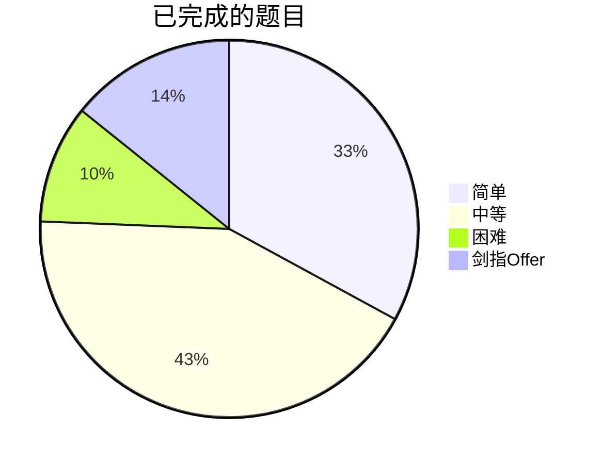

# 刷题记录

some exercises of leetcode

- Leetcode: 简单: 169, 中等: 219, 困难: 52, 剑指Offer: 73,
- 总计：513

| Number | Name | Difficulty | label |
|----|:--:|:------:|:-------:| 
| 1 | [Two Sum 两数之和](https://github.com/kaisa911/LeetCode/blob/master/package/thinkings/1-TwoSum.md) | Easy | 哈希 |
| 2 | [Add Two Numbers 两数相加](https://github.com/kaisa911/LeetCode/blob/master/package/thinkings/2-AddTwoNumbers.md) | Medium | 链表 |
| 3 | [Longest Substring Without Repeating Characters 无重复字符的最长子串](https://github.com/kaisa911/LeetCode/blob/master/package/thinkings/3-LongestSubstringWithoutRepeatingCharacters.md) | Medium | 滑动窗口 |
| 4 | [Median of Two Sorted Arrays 寻找两个正序数组的中位数](https://github.com/kaisa911/LeetCode/blob/master/package/thinkings/4-MedianofTwoSortedArrays.md) | Hard | 数组 |
| 5 | [Longest Palindromic Substring 最长回文子串](https://github.com/kaisa911/LeetCode/blob/master/package/thinkings/5-LongestPalindromicSubstring.md) | Medium | 双指针 |
| 6 | [ZigZag Conversion Z 字形变换](https://github.com/kaisa911/LeetCode/blob/master/package/thinkings/6-ZigZagConversion.md) | Medium | 字符串 |
| 7 | [Reverse Integer 翻转整数](https://github.com/kaisa911/LeetCode/blob/master/package/thinkings/7-ReverseInteger.md) | Medium | 字符串 |
| 8 | [String to Integer (atoi) 字符串转为整数](https://github.com/kaisa911/LeetCode/blob/master/package/thinkings/8-StringtoInteger(atoi).md) | Medium | 字符串 |
| 9 | [Palindrome Number 回文数字](https://github.com/kaisa911/LeetCode/blob/master/package/thinkings/9-PalindromeNumber.md) | Easy | 数学 |
| 10 | [Regular Expression Matching 正则表达式匹配](https://github.com/kaisa911/LeetCode/blob/master/package/thinkings/10-RegularExpressionMatching.md) | Hard | 正则、字符串 |
| 11 | [Container With Most Water 盛最多水的容器](https://github.com/kaisa911/LeetCode/blob/master/package/thinkings/11-ContainerWithMostWater.md) | Medium | 双指针 |
| 12 | [Integer to Roman 整数转罗马数字](https://github.com/kaisa911/LeetCode/blob/master/package/thinkings/12-IntegertoRoman.md) | Medium | 字符串 |
| 13 | [Roman to Integer 罗马数字转整数](https://github.com/kaisa911/LeetCode/blob/master/package/thinkings/13-RomantoInteger.md) | Easy | 字符串 |
| 14 | [Longest Common Prefix 最长共同前缀](https://github.com/kaisa911/LeetCode/blob/master/package/thinkings/14-LongestCommonPrefix.md) | Easy | 数组 |
| 15 | [3 Sum 三数之和](https://github.com/kaisa911/LeetCode/blob/master/package/thinkings/15-3Sum.md) | Medium | 双指针、排序 |
| 16 | [3 Sum Closest 最接近的三数之和](https://github.com/kaisa911/LeetCode/blob/master/package/thinkings/16-3SumClosest.md) | Medium | 双指针、排序 |
| 17 | [Letter Combinations of a Phone Number 电话号码的字母组合](https://github.com/kaisa911/LeetCode/blob/master/package/thinkings/17-LetterCombinationsofaPhoneNumber.md) | Medium | 字符串、回溯 |
| 18 | [4 Sum 四数之和](https://github.com/kaisa911/LeetCode/blob/master/package/thinkings/18-4Sum.md) | Medium | 双指针法、排序 |
| 19 | [Remove Nth Node From End of List 删除链表的倒数第 N 个节点](https://github.com/kaisa911/LeetCode/blob/master/package/thinkings/19-RemoveNthNodeFromEndofList.md) | Medium | 快慢指针 |
| 20 | [Valid Parentheses 有效的括号](https://github.com/kaisa911/LeetCode/blob/master/package/thinkings/20-ValidParentheses.md) | Easy | 栈 |
| 21 | [Merge Two Sorted Lists 合并两个有序链表](https://github.com/kaisa911/LeetCode/blob/master/package/thinkings/21-MergeTwoSortedLists.md) | Easy | 链表 |
| 22 | [Generate Parentheses 生成括号](https://github.com/kaisa911/LeetCode/blob/master/package/thinkings/22-GenerateParentheses.md) | Medium | 回溯 |
| 23 | [Merge k Sorted Lists 合并 K 个排序链表](https://github.com/kaisa911/LeetCode/blob/master/package/thinkings/23-MergekSortedLists.md) | Hard | 链表、分治 |
| 24 | [Swap Nodes In Pairs 两两交换链表中的节点](https://github.com/kaisa911/LeetCode/blob/master/package/thinkings/24-SwapNodesInPairs.md) | Medium | 链表、迭代法 |
| 25 | [Reverse Nodes in k-Group 每 k 个一组翻转链表](https://github.com/kaisa911/LeetCode/blob/master/package/thinkings/25-ReverseNodesink-Group.md) | Hard | 迭代、递归、链表 |
| 26 | [Remove Duplicates from Sorted Array 从有序数组中删除重复项](https://github.com/kaisa911/LeetCode/blob/master/package/thinkings/26-RemoveDuplicatesfromSortedArray.md) | Easy | 双指针 |
| 27 | [Remove Element 移除元素](https://github.com/kaisa911/LeetCode/blob/master/package/thinkings/27-RemoveElement.md) | Easy | 双指针 |
| 28 | [Implement strStr() 实现 strStr()](https://github.com/kaisa911/LeetCode/blob/master/package/thinkings/28-ImplementstrStr().md) | Easy | KMP算法 |
| 29 | [Divide Two Integers 两数相除](https://github.com/kaisa911/LeetCode/blob/master/package/thinkings/29-DivideTwoIntegers.md) | Medium | 贪心、位运算 |
| 30 | [Substring with Concatenation of All Words 串联所有单词的子串](https://github.com/kaisa911/LeetCode/blob/master/package/thinkings/30-SubstringwithConcatenationofAllWords.md) | Hard | 字符串、滑动窗口 |
| 31 | [Next-permutation 下一个排列](https://github.com/kaisa911/LeetCode/blob/master/package/thinkings/31-Next-permutation.md) | Medium | 数组 |
| 32 | [Longest Valid Parentheses 最长有效括号](https://github.com/kaisa911/LeetCode/blob/master/package/thinkings/32-LongestValidParentheses.md) | Hard | 栈 |
| 33 | [Search in Rotated Sorted Array 在旋转有序数组中搜索](https://github.com/kaisa911/LeetCode/blob/master/package/thinkings/33-SearchinRotatedSortedArray.md) | Medium | 数组、二分查找 |
| 34 | [Search for a Range 搜索范围](https://github.com/kaisa911/LeetCode/blob/master/package/thinkings/34-SearchforaRange.md) | Medium | 二分查找 |
| 35 | [Search Insert Position 搜索插入位置](https://github.com/kaisa911/LeetCode/blob/master/package/thinkings/35-SearchInsertPosition.md) | Easy | 二分查找 |
| 36 | [Valid Sudoku 验证数独](https://github.com/kaisa911/LeetCode/blob/master/package/thinkings/36-ValidSudoku.md) | Medium | 数组 |
| 37 | [Sudoku Solver 解数独](https://github.com/kaisa911/LeetCode/blob/master/package/thinkings/37-SudokuSolver.md) | Hard | DFS、回溯 |
| 38 | [Count and Say 数数并说](https://github.com/kaisa911/LeetCode/blob/master/package/thinkings/38-CountandSay.md) | Medium | 字符串 |
| 39 | [Combination Sum 组合之和](https://github.com/kaisa911/LeetCode/blob/master/package/thinkings/39-CombinationSum.md) | Medium | 回溯、数组 |
| 40 | [Combination Sum II 组合之和 II](https://github.com/kaisa911/LeetCode/blob/master/package/thinkings/40-CombinationSumII.md) | Medium | 回溯、数组 |
| 41 | [First Missing Positive 缺失的第一个正数](https://github.com/kaisa911/LeetCode/blob/master/package/thinkings/41-FirstMissingPositive.md) | Hard | 数组 |
| 42 | [Trapping Rain Water 接雨水](https://github.com/kaisa911/LeetCode/blob/master/package/thinkings/42-TrappingRainWater.md) | Hard | 双指针 |
| 43 | [Multiply String 字符串相乘](https://github.com/kaisa911/LeetCode/blob/master/package/thinkings/43-MultiplyString.md) | Medium | 字符串 |
| 44 | [Wildcard Matching 通配符匹配](https://github.com/kaisa911/LeetCode/blob/master/package/thinkings/44-WildcardMatching.md) | Hard | 动态规划 |
| 45 | [Jump Game II 跳跃游戏 II](https://github.com/kaisa911/LeetCode/blob/master/package/thinkings/45-JumpGameII.md) | Medium | 数组、贪心 |
| 46 | [Permutations 全排列](https://github.com/kaisa911/LeetCode/blob/master/package/thinkings/46-Permutations.md) | Medium | 回溯 |
| 47 | [Permutations II 全排列 II](https://github.com/kaisa911/LeetCode/blob/master/package/thinkings/47-PermutationsII.md) | Medium | 回溯 |
| 48 | [Rotate Image 旋转图像](https://github.com/kaisa911/LeetCode/blob/master/package/thinkings/48-RotateImage.md) | Medium | 数组 |
| 49 | [Group Anagrams 字母异位词分组](https://github.com/kaisa911/LeetCode/blob/master/package/thinkings/49-GroupAnagrams.md) | Medium | 哈希、排序 |
| 50 | [Pow(x, n) Pow(x, n)](https://github.com/kaisa911/LeetCode/blob/master/package/thinkings/50-Pow(x,n).md) | Medium | 数学 |
| 51 | [N-Queens N 皇后](https://github.com/kaisa911/LeetCode/blob/master/package/thinkings/51-N-Queens.md) | Hard | 回溯 |
| 52 | [N-Queens II N 皇后 II](https://github.com/kaisa911/LeetCode/blob/master/package/thinkings/52-N-QueensII.md) | Hard | 回溯 |
| 53 | [Maximum Subarray 最大子数组和](https://github.com/kaisa911/LeetCode/blob/master/package/thinkings/53-MaximumSubarray.md) | Medium | Kadane算法、动态规划 |
| 54 | [Spiral Matrix 螺旋矩阵](https://github.com/kaisa911/LeetCode/blob/master/package/thinkings/54-SpiralMatrix.md) | Medium | 矩阵 |
| 55 | [Jump Game 跳跃游戏](https://github.com/kaisa911/LeetCode/blob/master/package/thinkings/55-JumpGame.md) | Medium | 数组 |
| 56 | [Merge Intervals 合并区间](https://github.com/kaisa911/LeetCode/blob/master/package/thinkings/56-MergeIntervals.md) | Medium | 数组、排序 |
| 57 | [Insert Interval 插入区间](https://github.com/kaisa911/LeetCode/blob/master/package/thinkings/57-InsertInterval.md) | Hard | 数组、排序 |
| 58 | [Length of Last Word 最后一个单词的长度](https://github.com/kaisa911/LeetCode/blob/master/package/thinkings/58-LengthofLastWord.md) | Easy | 字符串 |
| 59 | [Spiral Matrix II 螺旋矩阵 II](https://github.com/kaisa911/LeetCode/blob/master/package/thinkings/59-SpiralMatrixII.md) | Medium | 矩阵 |
| 60 | [Permutation Sequence 排列序列](https://github.com/kaisa911/LeetCode/blob/master/package/thinkings/60-PermutationSequence.md) | Hard | 数学 |
| 61 | [Rotate List 旋转链表](https://github.com/kaisa911/LeetCode/blob/master/package/thinkings/61-RotateList.md) | Medium | 链表 |
| 62 | [Unique Paths 不同路径](https://github.com/kaisa911/LeetCode/blob/master/package/thinkings/62-UniquePaths.md) | Medium | 动态规划 |
| 63 | [Unique Paths II 不同路径 II](https://github.com/kaisa911/LeetCode/blob/master/package/thinkings/63-UniquePathsII.md) | Medium | 动态规划 |
| 64 | [Minimum Path Sum 最小路径和](https://github.com/kaisa911/LeetCode/blob/master/package/thinkings/64-MinimumPathSum.md) | Medium | 动态规划 |
| 65 | [Valid Number 有效数字](https://github.com/kaisa911/LeetCode/blob/master/package/thinkings/65-ValidNumber.md) | Hard | 正则 |
| 66 | [Plus One 加一](https://github.com/kaisa911/LeetCode/blob/master/package/thinkings/66-PlusOne.md) | Easy | 数组 |
| 67 | [Add Binary 二进制求和](https://github.com/kaisa911/LeetCode/blob/master/package/thinkings/67-AddBinary.md) | Easy | 字符串 |
| 68 | [Text Justification 文本左右对齐](https://github.com/kaisa911/LeetCode/blob/master/package/thinkings/68-TextJustification.md) | Hard | 贪心 |
| 69 | [Sqrt(x) x 的平方根](https://github.com/kaisa911/LeetCode/blob/master/package/thinkings/69-Sqrt(x).md) | Easy | 二分法 |
| 70 | [Climbing Stairs 爬楼梯](https://github.com/kaisa911/LeetCode/blob/master/package/thinkings/70-ClimbingStairs.md) | Easy | 动态规划 |
| 71 | [Simplify Path 简化路径](https://github.com/kaisa911/LeetCode/blob/master/package/thinkings/71-SimplifyPath.md) | Medium | 栈 |
| 72 | [Edit Distance 编辑距离](https://github.com/kaisa911/LeetCode/blob/master/package/thinkings/72-EditDistance.md) | Hard | 动态规划 |
| 73 | [Set Matrix Zeroes 矩阵置零](https://github.com/kaisa911/LeetCode/blob/master/package/thinkings/73-SetMatrixZeroes.md) | Medium | 矩阵 |
| 74 | [Search a 2D Matrix 搜索二维矩阵](https://github.com/kaisa911/LeetCode/blob/master/package/thinkings/74-Searcha2DMatrix.md) | Medium | 矩阵 |
| 75 | [Sort Colors 颜色分类](https://github.com/kaisa911/LeetCode/blob/master/package/thinkings/75-SortColors.md) | Medium | 快排 |
| 76 | [Minimum Window Substring 最小覆盖子串](https://github.com/kaisa911/LeetCode/blob/master/package/thinkings/76-MinimumWindowSubstring.md) | Hard | 子串、滑动窗口 |
| 77 | [Combinations 组合](https://github.com/kaisa911/LeetCode/blob/master/package/thinkings/77-Combinations.md) | Medium | 回溯 |
| 78 | [Subsets 子集](https://github.com/kaisa911/LeetCode/blob/master/package/thinkings/78-Subsets.md) | Medium | 回溯 |
| 79 | [Word Search 单词搜索](https://github.com/kaisa911/LeetCode/blob/master/package/thinkings/79-WordSearch.md) | Medium | 回溯、DFS |
| 80 | [Remove Duplicates from Sorted Array II 删除排序数组中的重复项 II](https://github.com/kaisa911/LeetCode/blob/master/package/thinkings/80-RemoveDuplicatesfromSortedArrayII.md) | Medium | 贪心 |
| 81 | [Searching Rotated Sorted Array II 搜索旋转排序数组 II](https://github.com/kaisa911/LeetCode/blob/master/package/thinkings/81-SearchingRotatedSortedArrayII.md) | Medium | 二分搜索 |
| 82 | [Remove Duplicate From Sorted List II 删除排序链表中的重复元素 II](https://github.com/kaisa911/LeetCode/blob/master/package/thinkings/82-RemoveDuplicateFromSortedListII.md) | Medium | 链表、双指针 |
| 83 | [Remove Duplicates from Sorted List 删除排序链表中的重复元素](https://github.com/kaisa911/LeetCode/blob/master/package/thinkings/83-RemoveDuplicatesfromSortedList.md) | Easy | 链表 |
| 84 | [Largest Rectangle in Histogram 柱状图中最大的矩形](https://github.com/kaisa911/LeetCode/blob/master/package/thinkings/84-LargestRectangleinHistogram.md) | Hard | 单调栈 |
| 85 | [Maximal Rectangle 最大矩形](https://github.com/kaisa911/LeetCode/blob/master/package/thinkings/85-MaximalRectangle.md) | Hard | 单调栈 |
| 86 | [Partition List 分隔链表](https://github.com/kaisa911/LeetCode/blob/master/package/thinkings/86-PartitionList.md) | Medium | 链表 |
| 87 | [Scramble String 扰乱字符串](https://github.com/kaisa911/LeetCode/blob/master/package/thinkings/87-ScrambleString.md) | Hard | 分治、哈希 |
| 88 | [Merge Sorted Array 合并两个有序数组](https://github.com/kaisa911/LeetCode/blob/master/package/thinkings/88-MergeSortedArray.md) | Easy | 数组、排序 |
| 89 | [Gray Code 格雷编码](https://github.com/kaisa911/LeetCode/blob/master/package/thinkings/89-GrayCode.md) | Medium | 数组 |
| 90 | [Subsets II 子集 II](https://github.com/kaisa911/LeetCode/blob/master/package/thinkings/90-SubsetsII.md) | Medium | 回溯 |
| 91 | [Decode Ways 解码方法](https://github.com/kaisa911/LeetCode/blob/master/package/thinkings/91-DecodeWays.md) | Medium | 动态规划 |
| 92 | [Reverse Linked List II 反转链表 II](https://github.com/kaisa911/LeetCode/blob/master/package/thinkings/92-ReverseLinkedListII.md) | Medium | 链表 |
| 93 | [Restore Ip Address 复原 IP 地址](https://github.com/kaisa911/LeetCode/blob/master/package/thinkings/93-RestoreIpAddress.md) | Medium | DFS |
| 94 | [Binary Tree Inorder Traversal 二叉树的中序遍历](https://github.com/kaisa911/LeetCode/blob/master/package/thinkings/94-BinaryTreeInorderTraversal.md) | Medium | 递归、二叉树 |
| 95 | [Unique Binary Search Trees II 不同的二叉搜索树 II](https://github.com/kaisa911/LeetCode/blob/master/package/thinkings/95-UniqueBinarySearchTreesII.md) | Medium | 二叉树、递归 |
| 96 | [Unique Binary Search Trees 不同的二叉搜索树](https://github.com/kaisa911/LeetCode/blob/master/package/thinkings/96-UniqueBinarySearchTrees.md) | Medium | 卡特兰数 |
| 97 | [Interleaving String 交错字符串](https://github.com/kaisa911/LeetCode/blob/master/package/thinkings/97-InterleavingString.md) | Medium | 动态规划 |
| 98 | [Validate Binary Search Tree 验证搜索二叉树](https://github.com/kaisa911/LeetCode/blob/master/package/thinkings/98-ValidateBinarySearchTree.md) | Medium | 二叉树 |
| 99 | [Recover Binary Search Tree 恢复搜索二叉树](https://github.com/kaisa911/LeetCode/blob/master/package/thinkings/99-RecoverBinarySearchTree.md) | Medium | 二叉树 |
| 100 | [Same Tree 相同的树](https://github.com/kaisa911/LeetCode/blob/master/package/thinkings/100-SameTree.md) | Easy | 二叉树 |
| 101 | [Symmetric Tree 对称二叉树](https://github.com/kaisa911/LeetCode/blob/master/package/thinkings/101-SymmetricTree.md) | Easy | BFS |
| 102 | [Binary Tree Level Order Traversal 二叉树的层序遍历](https://github.com/kaisa911/LeetCode/blob/master/package/thinkings/102-BinaryTreeLevelOrderTraversal.md) | Medium | 二叉树 |
| 103 | [Binary Tree Zigzag Level Order Traversal 二叉树的锯齿形层序遍历](https://github.com/kaisa911/LeetCode/blob/master/package/thinkings/103-BinaryTreeZigzagLevelOrderTraversal.md) | Medium | BFS |
| 104 | [Maximum Depth of Binary Tree 二叉树最大深度](https://github.com/kaisa911/LeetCode/blob/master/package/thinkings/104-MaximumDepthofBinaryTree.md) | Easy | DFS |
| 105 | [Construct Binary Tree from Preorder and Inorder Traversal 从前序与中序遍历序列构造二叉树](https://github.com/kaisa911/LeetCode/blob/master/package/thinkings/105-ConstructBinaryTreefromPreorderandInorderTraversal.md) | Medium | 二叉树 |
| 106 | [Construct Binary Tree from In order and Post order Traversal 从中序与后序遍历序列构造二叉树](https://github.com/kaisa911/LeetCode/blob/master/package/thinkings/106-ConstructBinaryTreefromInorderandPostorderTraversal.md) | Medium | 二叉树 |
| 107 | [Binary Tree Level Order Traversal II 二叉树的层次遍历 II](https://github.com/kaisa911/LeetCode/blob/master/package/thinkings/107-BinaryTreeLevelOrderTraversalII.md) | Easy | 二叉树 |
| 108 | [Convert Sorted Array to Binary Search Tree 将有序数组转换成二叉搜索树](https://github.com/kaisa911/LeetCode/blob/master/package/thinkings/108-ConvertSortedArraytoBinarySearchTree.md) | Easy | 二叉树 |
| 109 | [Convert Sorted List to Binary Search Tree 将有序链表转换为二叉搜索树](https://github.com/kaisa911/LeetCode/blob/master/package/thinkings/109-ConvertSortedListtoBinarySearchTree.md) | Medium | 链表、二叉树 |
| 110 | [Balanced Binary Tree 平衡二叉树](https://github.com/kaisa911/LeetCode/blob/master/package/thinkings/110-BalancedBinaryTree.md) | Easy | 二叉树 |
| 111 | [Minimum Depth of Binary Tree 二叉树的最小深度](https://github.com/kaisa911/LeetCode/blob/master/package/thinkings/111-MinimumDepthofBinaryTree.md) | Easy | 二叉树 |
| 112 | [Path Sum 路径总和](https://github.com/kaisa911/LeetCode/blob/master/package/thinkings/112-PathSum.md) | Easy | 递归 |
| 113 | [Path Sum II 路径总和 II](https://github.com/kaisa911/LeetCode/blob/master/package/thinkings/113-PathSumII.md) | Medium | 回溯 |
| 114 | [Flat Binary Tree to Linked List 二叉树展开为链表](https://github.com/kaisa911/LeetCode/blob/master/package/thinkings/114-FlatBinaryTreetoLinkedList.md) | Medium | 二叉树、链表 |
| 115 | [Distinct Subsequences 不同的子序列](https://github.com/kaisa911/LeetCode/blob/master/package/thinkings/115-DistinctSubsequences.md) | Hard | 动态规划 |
| 116 | [Populating Next Right Pointers in Each Node 填充每个节点的下一个右侧节点指针](https://github.com/kaisa911/LeetCode/blob/master/package/thinkings/116-PopulatingNextRightPointersinEachNode.md) | Medium | 层序遍历 |
| 117 | [Populating Next Right Pointers in Each Node II 填充每个节点的下一个右侧节点指针 II](https://github.com/kaisa911/LeetCode/blob/master/package/thinkings/117-PopulatingNextRightPointersinEachNodeII.md) | Medium | 层次遍历 |
| 118 | [Pascals Triangle 杨辉三角](https://github.com/kaisa911/LeetCode/blob/master/package/thinkings/118-PascalsTriangle.md) | Easy | 嵌套循环 |
| 119 | [Pascals Triangle II 杨辉三角 II](https://github.com/kaisa911/LeetCode/blob/master/package/thinkings/119-PascalsTriangleII.md) | Easy | 数组 |
| 120 | [Triangle 三角形最小路径和](https://github.com/kaisa911/LeetCode/blob/master/package/thinkings/120-Triangle.md) | Medium | 动态规划 |
| 121 | [Best Time to Buy and Sell Stock 买卖股票的最佳时机](https://github.com/kaisa911/LeetCode/blob/master/package/thinkings/121-BestTimetoBuyandSellStock.md) | Easy | 动态规划、遍历 |
| 122 | [Best Time to Buy and Sell Stock II 股票买卖的最佳时机 II](https://github.com/kaisa911/LeetCode/blob/master/package/thinkings/122-BestTimetoBuyandSellStockII.md) | Medium | 贪心、动态规划 |
| 123 | [Best Time to Buy and Sell Stock III 股票买卖的最佳时机 III](https://github.com/kaisa911/LeetCode/blob/master/package/thinkings/123-BestTimetoBuyandSellStockIII.md) | Hard | 动态规划 |
| 124 | [Binary Tree Maximum Path Sum 二叉树中的最大路径和](https://github.com/kaisa911/LeetCode/blob/master/package/thinkings/124-BinaryTreeMaximumPathSum.md) | Hard | 二叉树、DFS |
| 125 | [Is Palindrome 验证回文串](https://github.com/kaisa911/LeetCode/blob/master/package/thinkings/125-IsPalindrome.md) | Easy | 双指针 |
| 126 | [Word Ladder II 单词接龙 II](https://github.com/kaisa911/LeetCode/blob/master/package/thinkings/126-WordLadderII.md) | Hard | BFS、回溯 |
| 127 | [Word Ladder 单词接龙](https://github.com/kaisa911/LeetCode/blob/master/package/thinkings/127-WordLadder.md) | Hard | BFS |
| 128 | [Longest Consecutive Sequence 最长连续序列](https://github.com/kaisa911/LeetCode/blob/master/package/thinkings/128-LongestConsecutiveSequence.md) | Medium | 哈希 |
| 129 | [Sum Root to Leaf Numbers 求根到叶子节点数字之和](https://github.com/kaisa911/LeetCode/blob/master/package/thinkings/129-SumRoottoLeafNumbers.md) | Medium | 二叉树 |
| 130 | [Surrounded Regions 被围绕的区域](https://github.com/kaisa911/LeetCode/blob/master/package/thinkings/130-SurroundedRegions.md) | Medium | DFS |
| 131 | [Palindrome Partitioning 分隔回文串](https://github.com/kaisa911/LeetCode/blob/master/package/thinkings/131-PalindromePartitioning.md) | Medium | 回溯 |
| 132 | [Palindrome Partitioning II 分隔回文串II](https://github.com/kaisa911/LeetCode/blob/master/package/thinkings/132-PalindromePartitioningII.md) | Hard | 动态规划 |
| 133 | [Clone Graph 克隆图](https://github.com/kaisa911/LeetCode/blob/master/package/thinkings/133-CloneGraph.md) | Medium | DFS |
| 134 | [Gas Station 加油站](https://github.com/kaisa911/LeetCode/blob/master/package/thinkings/134-GasStation.md) | Medium | 数组、贪心 |
| 135 | [Candy 分发糖果](https://github.com/kaisa911/LeetCode/blob/master/package/thinkings/135-Candy.md) | Hard | 贪心 |
| 136 | [Single Number 只出现一次的数字](https://github.com/kaisa911/LeetCode/blob/master/package/thinkings/136-SingleNumber.md) | Easy | 异或 |
| 137 | [Single Number II 只出现一次的数字 II](https://github.com/kaisa911/LeetCode/blob/master/package/thinkings/137-SingleNumberII.md) | Medium | 位运算 |
| 138 | [Copy List with Random Pointer 随机链表的复制](https://github.com/kaisa911/LeetCode/blob/master/package/thinkings/138-CopyListwithRandomPointer.md) | Medium | 链表、哈希 |
| 139 | [Word Break 单词拆分](https://github.com/kaisa911/LeetCode/blob/master/package/thinkings/139-WordBreak.md) | Medium | 动态规划 |
| 140 | [Word Break II 单词拆分 II](https://github.com/kaisa911/LeetCode/blob/master/package/thinkings/140-WordBreakII.md) | Hard | 记忆化搜索、回溯 |
| 141 | [Linked List Cycle 环形链表](https://github.com/kaisa911/LeetCode/blob/master/package/thinkings/141-LinkedListCycle.md) | Easy | 双指针、哈希 |
| 142 | [Linked List Cycle II 环形链表 II](https://github.com/kaisa911/LeetCode/blob/master/package/thinkings/142-LinkedListCycleII.md) | Medium | 双指针、哈希 |
| 143 | [Reorder List 重排链表](https://github.com/kaisa911/LeetCode/blob/master/package/thinkings/143-ReorderList.md) | Medium | 双指针 |
| 144 | [Binary Tree Preorder Traversal 二叉树的前序遍历](https://github.com/kaisa911/LeetCode/blob/master/package/thinkings/144-BinaryTreePreorderTraversal.md) | Easy | 二叉树、栈 |
| 145 | [Binary Tree Postorder Traversal 二叉树的后序遍历](https://github.com/kaisa911/LeetCode/blob/master/package/thinkings/145-BinaryTreePostorderTraversal.md) | Easy | 二叉树、栈 |
| 146 | [LRU Cache LRU 缓存](https://github.com/kaisa911/LeetCode/blob/master/package/thinkings/146-LRUCache.md) | Medium | LRU |
| 147 | [Insertion Sort List 对链表进行插入排序](https://github.com/kaisa911/LeetCode/blob/master/package/thinkings/147-InsertionSortList.md) | Medium | 链表、排序 |
| 148 | [Sort List 排序链表](https://github.com/kaisa911/LeetCode/blob/master/package/thinkings/148-SortList.md) | Medium | 链表、排序 |
| 149 | [Max Points on a Line 直线上最多的点](https://github.com/kaisa911/LeetCode/blob/master/package/thinkings/149-MaxPointsonaLine.md) | Hard | 哈希 |
| 150 | [Evaluate Reverse Polish Notation 逆波兰表达式求值](https://github.com/kaisa911/LeetCode/blob/master/package/thinkings/150-EvaluateReversePolishNotation.md) | Medium | 栈 |
| 151 | [Reverse Words in a String 反转字符串中的单词](https://github.com/kaisa911/LeetCode/blob/master/package/thinkings/151-ReverseWordsinaString.md) | Medium | 双指针 |
| 152 | [Maximum Product Subarray 乘积最大子数组](https://github.com/kaisa911/LeetCode/blob/master/package/thinkings/152-MaximumProductSubarray.md) | Medium | 动态规划 |
| 153 | [Find Minimum in Rotated Sorted Array 寻找旋转排序数组中的最小值](https://github.com/kaisa911/LeetCode/blob/master/package/thinkings/153-FindMinimuminRotatedSortedArray.md) | Medium | 二分查找 |
| 155 | [Min Stack 最小栈](https://github.com/kaisa911/LeetCode/blob/master/package/thinkings/155-MinStack.md) | Easy | 数组 |
| 160 | [Intersection of Two Linked List 相交链表](https://github.com/kaisa911/LeetCode/blob/master/package/thinkings/160-IntersectionofTwoLinkedList.md) | Easy | 双指针 |
| 162 | [Find Peak Element 寻找峰值](https://github.com/kaisa911/LeetCode/blob/master/package/thinkings/162-FindPeakElement.md) | Medium | 二分查找 |
| 164 | [Maximum Gap 最大间距](https://github.com/kaisa911/LeetCode/blob/master/package/thinkings/164-MaximumGap.md) | Medium | 桶排序 |
| 165 | [Compare Version Numbers 比较版本号](https://github.com/kaisa911/LeetCode/blob/master/package/thinkings/165-CompareVersionNumbers.md) | Easy | 字符串 |
| 166 | [Fraction to Recurring Decimal 分数到小数](https://github.com/kaisa911/LeetCode/blob/master/package/thinkings/166-FractiontoRecurringDecimal.md) | Medium | 长除法 |
| 167 | [Two Sum II 两数之和 II](https://github.com/kaisa911/LeetCode/blob/master/package/thinkings/167-TwoSumII.md) | Easy | 双指针 |
| 168 | [Excel Sheet Column Title Excel 列表名称](https://github.com/kaisa911/LeetCode/blob/master/package/thinkings/168-ExcelSheetColumnTitle.md) | Easy | 数学方法 |
| 169 | [Majority Element 求众数](https://github.com/kaisa911/LeetCode/blob/master/package/thinkings/169-MajorityElement.md) | Easy | Boyer-Moore 投票算法 |
| 171 | [Excel Sheet Column Number Excel 表列序号](https://github.com/kaisa911/LeetCode/blob/master/package/thinkings/171-ExcelSheetColumnNumberExcel.md) | Easy | 字符串 |
| 172 | [Factorial Trailing Zeroes 阶乘后的零](https://github.com/kaisa911/LeetCode/blob/master/package/thinkings/172-FactorialTrailingZeroes.md) | Easy | 数学 |
| 179 | [Largest Number 最大数](https://github.com/kaisa911/LeetCode/blob/master/package/thinkings/179-LargestNumber.md) | Medium | 数组、排序 |
| 189 | [Rotate Array 旋转数组](https://github.com/kaisa911/LeetCode/blob/master/package/thinkings/189-RotateArray.md) | Easy | 数组 |
| 190 | [Reverse Bits 颠倒二进制位](https://github.com/kaisa911/LeetCode/blob/master/package/thinkings/190-ReverseBits.md) | Easy | 位运算 |
| 191 | [Number of 1 Bits 位 1 的个数](https://github.com/kaisa911/LeetCode/blob/master/package/thinkings/191-Numberof1Bits.md) | Easy | 位运算 |
| 198 | [House Robber 打家劫舍](https://github.com/kaisa911/LeetCode/blob/master/package/thinkings/198-HouseRobber.md) | Easy | 动态规划 |
| 199 | [Binary Tree Right Side View 二叉树的右视图](https://github.com/kaisa911/LeetCode/blob/master/package/thinkings/199-BinaryTreeRightSideView.md) | Medium | BFS |
| 200 | [Number of Islands 岛屿数量](https://github.com/kaisa911/LeetCode/blob/master/package/thinkings/200-NumberofIslands.md) | Medium | 图、DFS |
| 202 | [Happy Number 快乐数](https://github.com/kaisa911/LeetCode/blob/master/package/thinkings/202-HappyNumber.md) | Easy | 双指针 |
| 203 | [Remove Linked List Elements 删除链表中的元素](https://github.com/kaisa911/LeetCode/blob/master/package/thinkings/203-RemoveLinkedListElements.md) | Easy | 链表 |
| 204 | [Count Primes 计数质数](https://github.com/kaisa911/LeetCode/blob/master/package/thinkings/204-CountPrimes.md) | Easy | 厄拉多塞筛法 |
| 205 | [Isomorphic Strings 同构字符串](https://github.com/kaisa911/LeetCode/blob/master/package/thinkings/205-IsomorphicStrings.md) | Easy | 字符串 |
| 206 | [Reverse Linked List 反转链表](https://github.com/kaisa911/LeetCode/blob/master/package/thinkings/206-ReverseLinkedList.md) | Easy | 双指针、链表 |
| 207 | [Course Schedule 课程表](https://github.com/kaisa911/LeetCode/blob/master/package/thinkings/207-CourseSchedule.md) | Medium | 图、拓扑排序 |
| 208 | [Implement Tire (Prefix Tree) 实现Tire（前缀树）](https://github.com/kaisa911/LeetCode/blob/master/Thinkings/Medium/208-ImplementTire(PrefixTree).md) | Medium | 前缀树 |
| 210 | [Course Schedule II 课程表 II](https://github.com/kaisa911/LeetCode/blob/master/Thinkings/Medium/210-CourseScheduleII.md) | Medium | BFS |
| 212 | [Word Search II 单词搜索 II](https://github.com/kaisa911/LeetCode/blob/master/package/thinkings/212-WordSearchII.md) | Hard | 字典树、DFS |
| 214 | [Shortest Palindrome 最短回文串](https://github.com/kaisa911/LeetCode/blob/master/Thinkings/Hard/214-ShortestPalindrome.md) | Hard | KMP |
| 215 | [Kth Largest Element in an Array 数组中的第 K 大元素](https://github.com/kaisa911/LeetCode/blob/master/package/thinkings/215-KthLargestElementinanArray.md) | Medium | 快速选择 |
| 216 | [Combination Sum III 组合总和 III](https://github.com/kaisa911/LeetCode/blob/master/Thinkings/Medium/216-CombinationSumIII.md) | Medium | 空间枚举 |
| 217 | [Contains Duplicate 存在重复元素](https://github.com/kaisa911/LeetCode/blob/master/package/thinkings/217-ContainsDuplicate.md) | Easy | 哈希 |
| 218 | [The Skyline Problem 天际线问题](https://github.com/kaisa911/LeetCode/blob/master/Thinkings/Hard/218-TheSkylineProblem.md) | Hard | 二分查找 |
| 219 | [Contains Nearby Duplicate II 存在重复元素 II](https://github.com/kaisa911/LeetCode/blob/master/Thinkings/Easy/219-ContainsNearbyDuplicateII.md) | Easy |  |
| 220 | [Contains Nearby Duplicate III 存在重复元素 III](https://github.com/kaisa911/LeetCode/blob/master/Thinkings/Hard/220-ContainsNearbyDuplicateIII.md) | Hard | 桶排序 |
| 221 | [Maximal Square 最大正方形](https://github.com/kaisa911/LeetCode/blob/master/Thinkings/Medium/221-MaximalSquare.md) | Medium | 动态规划 |
| 225 | [Implement Stack using Queues 用队列实现栈](https://github.com/kaisa911/LeetCode/blob/master/Thinkings/Easy/225-ImplementStackusingQueues.md) | Easy |  |
| 226 | [Invert Binary Tree 翻转二叉树](https://github.com/kaisa911/LeetCode/blob/master/Thinkings/Easy/226-InvertBinaryTree.md) | Easy | 二叉树 |
| 227 | [Basic Calculator II 基本计算器 II](https://github.com/kaisa911/LeetCode/blob/master/Thinkings/Medium/227-BasicCalculatorII.md) | Medium | 栈 |
| 228 | [Summary Ranges 汇总区间](https://github.com/kaisa911/LeetCode/blob/master/package/thinkings/228-SummaryRanges.md) | Easy | 贪心 |
| 230 | [Kth Smallest Element in a BST 二叉搜索树中的第 K 小的元素](https://github.com/kaisa911/LeetCode/blob/master/Thinkings/Medium/230-KthSmallestElementinaBST.md) | Medium | 二叉树 |
| 231 | [Power of Two 2 的幂](https://github.com/kaisa911/LeetCode/blob/master/Thinkings/Easy/231-PowerofTwo.md) | Easy |  |
| 232 | [Implement Queue using Stacks 用栈实现队列](https://github.com/kaisa911/LeetCode/blob/master/Thinkings/Easy/232-ImplementQueueusingStacks.md) | Easy |  |
| 233 | [Number of Digit One 数字 1 的个数](https://github.com/kaisa911/LeetCode/blob/master/Thinkings/Hard/233-NumberofDigitOne.md) | Hard |  |
| 234 | [Palindrome Linked List 回文链表](https://github.com/kaisa911/LeetCode/blob/master/Thinkings/Easy/234-PalindromeLinkedList.md) | Easy | 双指针 |
| 235 | [Lowest Common Ancestor of a Binary Search Tree 二叉搜索树的最近公共祖先](https://github.com/kaisa911/LeetCode/blob/master/Thinkings/Medium/235-LowestCommonAncestorofaBinarySearchTree.md) | Medium | 二叉树 |
| 236 | [Lowest Common Ancestor of a Binary Tree 二叉树的最近公共祖先](https://github.com/kaisa911/LeetCode/blob/master/Thinkings/Medium/236-LowestCommonAncestorofaBinaryTree.md) | Medium | 二叉树 |
| 237 | [Delete Node in a Linked List 删除链表中的节点](https://github.com/kaisa911/LeetCode/blob/master/Thinkings/Medium/237-DeleteNodeinaLinkedList.md) | Medium | 链表 |
| 238 | [Product of Array Except Self 除自身以外数组的乘积](https://github.com/kaisa911/LeetCode/blob/master/package/thinkings/238-ProductofArrayExceptSelf.md) | Medium | 数组 |
| 239 | [Slide Window Maximum 滑动窗口最大值](https://github.com/kaisa911/LeetCode/blob/master/Solutions/Hard/239-SlideWindowMaximum.js) | Hard | 子串 |
| 240 | [Search a 2D Matrix II 搜索二维矩阵 II](https://github.com/kaisa911/LeetCode/blob/master/Solutions/Medium/240-Searcha2DMatrixII.js) | Medium | 二分查找 |
| 242 | [Valid Anagram 有效的字母异位词](https://github.com/kaisa911/LeetCode/blob/master/package/thinkings/242-ValidAnagram.md) | Easy | 字符串、哈希 |
| 257 | [Binary Tree Paths 二叉树的所有路径](https://github.com/kaisa911/LeetCode/blob/master/package/thinkings/257-BinaryTreePaths.md) | Easy | 回溯 |
| 258 | [Add Digits 各位相加](https://github.com/kaisa911/LeetCode/blob/master/package/thinkings/258-AddDigits.md) | Easy | 数学、递归 |
| 260 | [Single Number III 只出现一次的数字 III](https://github.com/kaisa911/LeetCode/blob/master/package/thinkings/260-SingleNumberIII.md) | Medium | 位运算 |
| 263 | [Ugly Number 丑数](https://github.com/kaisa911/LeetCode/blob/master/package/thinkings/263-UglyNumber.md) | Easy | 数学 |
| 268 | [Missing Number 缺失数字](https://github.com/kaisa911/LeetCode/blob/master/Solutions/Easy/268-MissingNumber.js) | Easy |  |
| 274 | [H-Index H 指数](https://github.com/kaisa911/LeetCode/blob/master/Solutions/Medium/274-H-Index.js) | Medium |  |
| 278 | [First Bad Version 第一个错误的版本](https://github.com/kaisa911/LeetCode/blob/master/package/thinkings/278-FirstBadVersion.md) | Easy | 二分查找 |
| 279 | [Perfect Squares 完全平方数](https://github.com/kaisa911/LeetCode/blob/master/Solutions/Medium/279-PerfectSquares.js) | Medium | 动态规划 |
| 283 | [Move Zeroes 移动零](https://github.com/kaisa911/LeetCode/blob/master/Solutions/Easy/283-MoveZeroes.js) | Easy | 双指针 |
| 287 | [Find the Duplicate Number 寻找重复数](https://github.com/kaisa911/LeetCode/blob/master/package/thinkings/287-FindtheDuplicateNumber.md) | Medium | 布隆过滤 |
| 289 | [Game of Life 生命游戏](https://github.com/kaisa911/LeetCode/blob/master/Solutions/Medium/289-GameofLife.js) | Medium | 数组 |
| 290 | [Word Pattern 单词规律](https://github.com/kaisa911/LeetCode/blob/master/package/thinkings/290-WordPattern.md) | Easy | 字符串 |
| 292 | [Nim Game Nim 游戏](https://github.com/kaisa911/LeetCode/blob/master/Solutions/Easy/292-NimGame.js) | Easy | 数学 |
| 295 | [Find Median from Data Stream 数据流的中位数](https://github.com/kaisa911/LeetCode/blob/master/Solutions/Hard/295-FindMedianfromDataStream.js) | Hard |  |
| 297 | [Serialize and Deserialize Binary Tree 二叉树的序列化与反序列化](https://github.com/kaisa911/LeetCode/blob/master/Solutions/Hard/297-SerializeandDeserializeBinaryTree.js) | Hard |  |
| 300 | [Longest Increasing Subsequence 最长上升子序列](https://github.com/kaisa911/LeetCode/blob/master/Solutions/Medium/300-LongestIncreasingSubsequence.js) | Medium |  |
| 301 | [Remove Invalid Parentheses 删除无效的括号](https://github.com/kaisa911/LeetCode/blob/master/Solutions/Hard/301-RemoveInvalidParentheses.js) | Hard | BFS |
| 303 | [Range Sum Query-Immutable 区域和检索-数组不可变](https://github.com/kaisa911/LeetCode/blob/master/package/thinkings/303-RangeSumQuery-Immutable.md) | Easy | 数组 |
| 309 | [Best Time to Buy and Sell Stock with Cooldown 买卖股票的最佳时机含冷冻期](https://github.com/kaisa911/LeetCode/blob/master/Solutions/Medium/309-BestTimetoBuyandSellStockwithCooldown.js) | Medium | 动态规划 |
| 310 | [Minimum Height Trees 最小高度树](https://github.com/kaisa911/LeetCode/blob/master/package/thinkings/310-MinimumHeightTrees.md) | Medium | 队列 |
| 312 | [Burst Balloons 戳气球](https://github.com/kaisa911/LeetCode/blob/master/Solutions/Hard/312-BurstBalloons.js) | Hard | 动态规划 |
| 315 | [Count of Smallest Numbers After Self 计算右侧小于当前元素的个数](https://github.com/kaisa911/LeetCode/blob/master/Solutions/Hard/315-CountofSmallestNumbersAfterSelf.js) | Hard | 归并排序 |
| 319 | [Bulb Switcher 灯泡开关](https://github.com/kaisa911/LeetCode/blob/master/package/thinkings/319-BulbSwitcher.md) | Medium | 数学 |
| 322 | [Coin Change 零钱兑换](https://github.com/kaisa911/LeetCode/blob/master/Solutions/Medium/322-CoinChange.js) | Medium | 动态规划 |
| 324 | [Wiggle Sort II 摆动排序 II](https://github.com/kaisa911/LeetCode/blob/master/Solutions/Medium/324-WiggleSortII.js) | Medium | 排序 |
| 326 | [Power of Three 3 的幂](https://github.com/kaisa911/LeetCode/blob/master/Solutions/Easy/326-PowerofThree.js) | Easy |  |
| 328 | [Odd Even Linked List 奇偶链表](https://github.com/kaisa911/LeetCode/blob/master/Solutions/Medium/328-OddEvenLinkedList.js) | Medium | 链表 |
| 329 | [Longest Increasing Path in a Matrix 矩阵中的最长递增路径](https://github.com/kaisa911/LeetCode/blob/master/Solutions/Hard/329-LongestIncreasingPathinaMatrix.js) | Hard | 记忆化搜索 |
| 332 | [Reconstruct Itinerary 重新安排行程](https://github.com/kaisa911/LeetCode/blob/master/Solutions/Hard/332-ReconstructItinerary.js) | Hard | DFS |
| 334 | [Increasing Triplet Subsequence 递增的三元子序列](https://github.com/kaisa911/LeetCode/blob/master/Solutions/Medium/334-IncreasingTripletSubsequence.js) | Medium | 贪心、数组 |
| 337 | [House Robber III 打家劫舍 III](https://github.com/kaisa911/LeetCode/blob/master/Solutions/Medium/337-HouseRobberIII.js) | Medium | 动态规划 |
| 338 | [Counting Bits 比特位计数](https://github.com/kaisa911/LeetCode/blob/master/Solutions/Easy/338-CountingBits.js) | Easy |  |
| 341 | [Flatten Nested List Iterator 扁平化嵌套列表迭代器](https://github.com/kaisa911/LeetCode/blob/master/Solutions/Medium/341-FlattenNestedListIterator.js) | Medium | 栈 |
| 342 | [Power of Four 4 的幂](https://github.com/kaisa911/LeetCode/blob/master/Solutions/Easy/342-PowerofFour.js) | Easy |  |
| 343 | [Integer Break 整数拆分](https://github.com/kaisa911/LeetCode/blob/master/Solutions/Medium/343-IntegerBreak.js) | Medium |  |
| 344 | [Reverse String 反转字符串](https://github.com/kaisa911/LeetCode/blob/master/Solutions/Easy/344-ReverseString.js) | Easy |  |
| 345 | [Reverse Vowels of a String 翻转字符串中的元音字母](https://github.com/kaisa911/LeetCode/blob/master/Solutions/Easy/345-ReverseVowelsofaString.js) | Easy | 双指针 |
| 347 | [Top K Frequent Elements 前 K 个高频元素](https://github.com/kaisa911/LeetCode/blob/master/Solutions/Medium/347-TopKFrequentElements.js) | Medium | 桶排序 |
| 349 | [Intersection of Two Arrays 两个数组的交集](https://github.com/kaisa911/LeetCode/blob/master/Solutions/Easy/349-IntersectionofTwoArrays.js) | Easy |  |
| 350 | [Intersection of Two Arrays II 两个数组的交集 II](https://github.com/kaisa911/LeetCode/blob/master/package/thinkings/350-IntersectionofTwoArraysII.md) | Easy |  |
| 365 | [Water and Jug Problem 水壶问题](https://github.com/kaisa911/LeetCode/blob/master/Solutions/Medium/365-WaterandJugProblem.js) | Medium | 数学方法 |
| 371 | [Sum of Two Integers 两个整数相加](https://github.com/kaisa911/LeetCode/blob/master/package/thinkings/371-SumofTwoIntegers.md) | Easy | 位运算 |
| 373 | [Find K Pairs with Smallest Sums 查找和最小的 K 对数字](https://github.com/kaisa911/LeetCode/blob/master/Solutions/Medium/373-FindKPairswithSmallestSums.js) | Medium |  |
| 374 | [Guess Number Higher or lower 猜数字大小](https://github.com/kaisa911/LeetCode/blob/master/Solutions/Easy/374-GuessNumberHigherorlower.js) | Easy | 二分查找 |
| 377 | [Combination Sum IV 组合总和 Ⅳ](https://github.com/kaisa911/LeetCode/blob/master/package/thinkings/377-CombinationSumIV.md) | Medium | 动态规划、回溯 |
| 378 | [Kth Smallest Element in a Sorted Matrix 有序矩阵中第 K 小的元素](https://github.com/kaisa911/LeetCode/blob/master/Solutions/Medium/378-KthSmallestElementinaSortedMatrix.js) | Medium | 二分查找 |
| 380 | [Insert Delete GetRandom O1 O(1)时间插入删除和获取随机元素](https://github.com/kaisa911/LeetCode/blob/master/Solutions/Medium/380-InsertDeleteGetRandomO1.js) | Medium | 哈希 |
| 381 | [Insert Delete GetRandom O(1) - Duplicates allowed O(1)时间插入删除和获取随机元素-允许重复](https://github.com/kaisa911/LeetCode/blob/master/Solutions/Hard/381-InsertDeleteGetRandomO(1)-Duplicatesallowed.js) | Hard | 哈希 |
| 383 | [Ransom Note 赎金信](https://github.com/kaisa911/LeetCode/blob/master/package/thinkings/383-RansomNote.md) | Easy | 哈希表 |
| 384 | [Shuffle an Array 打乱数组](https://github.com/kaisa911/LeetCode/blob/master/Solutions/Medium/384-ShuffleanArray.js) | Medium | 数组 |
| 387 | [First Unique Character in a String 字符串中的第一个唯一字符](https://github.com/kaisa911/LeetCode/blob/master/package/thinkings/387-FirstUniqueCharacterinaString.md) | Easy | 哈希 |
| 389 | [Find The Difference 找不同](https://github.com/kaisa911/LeetCode/blob/master/Solutions/Easy/389-FindTheDifference.js) | Easy |  |
| 392 | [Is Subsequence 判断子序列](https://github.com/kaisa911/LeetCode/blob/master/package/thinkings/392-IsSubsequence.md) | Easy | 子串 |
| 394 | [Decode String 字符串解码](https://github.com/kaisa911/LeetCode/blob/master/Solutions/Medium/394-DecodeString.js) | Medium |  |
| 395 | [Longest Substring with At Least K Repeating Characters 至少有 K 个充数字符的最长子串](https://github.com/kaisa911/LeetCode/blob/master/Solutions/Medium/395-LongestSubstringwithAtLeastKRepeatingCharacters.js) | Medium | 分治 |
| 399 | [Evaluate Division 除法求值](https://github.com/kaisa911/LeetCode/blob/master/Solutions/Medium/399-EvaluateDivision.js) | Medium | 图、DFS |
| 400 | [Find Nth Digit 第 N 个数字](https://github.com/kaisa911/LeetCode/blob/master/package/thinkings/400-FindNthDigit.md) | Medium | 字符串 |
| 405 | [Convert a Number to Hexadecimal 转 16 进制](https://github.com/kaisa911/LeetCode/blob/master/Solutions/Easy/405-ConvertaNumbertoHexadecimal.js) | Easy |  |
| 406 | [Queue Reconstruction by Height 根据身高重建队列](https://github.com/kaisa911/LeetCode/blob/master/Solutions/Medium/406-QueueReconstructionbyHeight.js) | Medium | 数组 |
| 409 | [Longest Palindrome 最长回文串](https://github.com/kaisa911/LeetCode/blob/master/package/thinkings/409-LongestPalindrome.md) | Easy | 贪心、字符串 |
| 412 | [Fizz Buzz Fizz Buzz](https://github.com/kaisa911/LeetCode/blob/master/Solutions/Easy/412-FizzBuzz.js) | Easy | 字符串 |
| 414 | [Third Maximum Number 第三大的数](https://github.com/kaisa911/LeetCode/blob/master/Solutions/Easy/414-ThirdMaximumNumber.js) | Easy |  |
| 415 | [Add Strings 字符串相加](https://github.com/kaisa911/LeetCode/blob/master/Solutions/Easy/415-AddStrings.js) | Easy | 模拟 |
| 416 | [Partition Equal Subset Sum 分割等和子集](https://github.com/kaisa911/LeetCode/blob/master/Solutions/Medium/416-PartitionEqualSubsetSum.js) | Medium | 动态规划 |
| 435 | [Non-overlapping Intervals 无重叠区间](https://github.com/kaisa911/LeetCode/blob/master/Solutions/Medium/435-Non-overlappingIntervals.js) | Medium | 区间集合 |
| 437 | [Path Sum III 路径总和 III](https://github.com/kaisa911/LeetCode/blob/master/Solutions/Medium/437-PathSumIII.js) | Medium | 二叉树、DFS |
| 438 | [Find All Anagrams in a String 找到字符串中所有字母异位词](https://github.com/kaisa911/LeetCode/blob/master/Solutions/Medium/438-FindAllAnagramsinaString.js) | Medium | 滑动窗口 |
| 440 | [Kth Smallest in Lexicographical Order 字典序的第 K 小数字](https://github.com/kaisa911/LeetCode/blob/master/Solutions/Hard/440-KthSmallestinLexicographicalOrder.js) | Hard | 字典树 |
| 441 | [Arranging Coins 排列硬币](https://github.com/kaisa911/LeetCode/blob/master/Solutions/Easy/441-ArrangingCoins.js) | Easy | 二分查找 |
| 442 | [Find All Duplicates in an Array 数组中重复的数据](https://github.com/kaisa911/LeetCode/blob/master/Solutions/Medium/442-FindAllDuplicatesinanArray.js) | Medium | 数组 |
| 443 | [String Compression 压缩字符串](https://github.com/kaisa911/LeetCode/blob/master/Solutions/Medium/443-StringCompression.js) | Medium | 字符串、双指针 |
| 447 | [Number of Boomerangs 回旋镖的数量](https://github.com/kaisa911/LeetCode/blob/master/Solutions/Medium/447-NumberofBoomerangs.js) | Medium | 哈希 |
| 448 | [Find All Numbers Disappeared in an Array 找到所有数组中消失的数字](https://github.com/kaisa911/LeetCode/blob/master/Thinkings/Easy/448-FindAllNumbersDisappearedinanArray.md) | Easy |  |
| 450 | [Delete Node in a BST 删除二叉搜索树中的节点](https://github.com/kaisa911/LeetCode/blob/master/Solutions/Medium/450-DeleteNodeinaBST.js) | Medium | 二叉搜索树 |
| 452 | [Minimum Number of Arrows to Burst Balloons 用最少数量的箭引爆气球](https://github.com/kaisa911/LeetCode/blob/master/Solutions/Medium/452-MinimumNumberofArrowstoBurstBalloons.js) | Medium | 区间集合 |
| 454 | [4Sum II 四数相加 II](https://github.com/kaisa911/LeetCode/blob/master/Solutions/Medium/454-4SumII.js) | Medium | 哈希 |
| 455 | [Assign Cookies 分发饼干](https://github.com/kaisa911/LeetCode/blob/master/Thinkings/Easy/455-AssignCookies.md) | Easy |  |
| 456 | [132 Pattern 132 模式](https://github.com/kaisa911/LeetCode/blob/master/Solutions/Medium/456-132Pattern.js) | Medium | 枚举 |
| 458 | [Poor Pigs 可怜的小猪](https://github.com/kaisa911/LeetCode/blob/master/Solutions/Hard/458-PoorPigs.js) | Hard |  |
| 459 | [Repeated Substring Pattern 重复的子字符串](https://github.com/kaisa911/LeetCode/blob/master/Thinkings/Easy/459-RepeatedSubstringPattern.md) | Easy |  |
| 461 | [Hamming Distance 汉明距离](https://github.com/kaisa911/LeetCode/blob/master/Solutions/Easy/461-HammingDistance.js) | Easy | 位运算 |
| 462 | [Minimum Move to Equal Array Elements II 最小操作次数是数组元素相等II](https://github.com/kaisa911/LeetCode/blob/master/Solutions/Medium/462-MinimumMovetoEqualArrayElementsII.js) | Medium | 排序 |
| 463 | [Island Perimeter 岛屿的周长](https://github.com/kaisa911/LeetCode/blob/master/Solutions/Easy/463-IslandPerimeter.js) | Easy | DFS |
| 464 | [Can I Win 我能赢吗](https://github.com/kaisa911/LeetCode/blob/master/Solutions/Easy/464-CanIWin.js) | Easy |  |
| 485 | [Find Max Consecutive Ones 最大连续 1 的个数](https://github.com/kaisa911/LeetCode/blob/master/Solutions/Easy/485-FindMaxConsecutiveOnes.js) | Easy |  |
| 486 | [Predict the Winner 预测赢家](https://github.com/kaisa911/LeetCode/blob/master/Solutions/Medium/486-PredicttheWinner.js) | Medium | 动态规划 |
| 491 | [Non- decreasing Subsequence 递增子序列](https://github.com/kaisa911/LeetCode/blob/master/Solutions/Medium/491-Non-decreasingSubsequence.js) | Medium | DFS |
| 494 | [Target Sum 目标和](https://github.com/kaisa911/LeetCode/blob/master/Solutions/Medium/494-TargetSum.js) | Medium | 回溯 |
| 496 | [Next Greater Element I 下一个更大元素 I](https://github.com/kaisa911/LeetCode/blob/master/Solutions/Easy/496-NextGreaterElementI.js) | Easy | 哈希 |
| 509 | [Fibonacci 斐波那契数](https://github.com/kaisa911/LeetCode/blob/master/Thinkings/Easy/509-Fibonacci.md) | Easy |  |
| 518 | [Coin Change II 零钱兑换 II](https://github.com/kaisa911/LeetCode/blob/master/package/thinkings/518-CoinChangeII.md) | Medium | 动态规划 |
| 519 | [Random Flip Matrix 随机翻转矩阵](https://github.com/kaisa911/LeetCode/blob/master/package/thinkings/519-RandomFlipMatrix.md) | Medium | 数组 |
| 529 | [Minesweeper 扫雷游戏](https://github.com/kaisa911/LeetCode/blob/master/Solutions/Medium/529-Minesweeper.js) | Medium |  |
| 532 | [K-diff Pairs in an Array 数组中的 k-diff 数对](https://github.com/kaisa911/LeetCode/blob/master/package/thinkings/532-K-diffPairsinanArray.md) | Medium | 哈希 |
| 538 | [Convert BST to Greater Tree 把二叉搜索树转换为累加树](https://github.com/kaisa911/LeetCode/blob/master/Solutions/Medium/538-ConvertBSTtoGreaterTree.js) | Medium | 二叉树 |
| 541 | [Reverse String II 反转字符串 II](https://github.com/kaisa911/LeetCode/blob/master/Thinkings/Easy/541-ReverseStringII.md) | Easy |  |
| 543 | [Diameter of Binary Tree 二叉树的直径](https://github.com/kaisa911/LeetCode/blob/master/Solutions/Easy/543-DiameterofBinaryTree.js) | Easy | 二叉树 |
| 547 | [Number of Provinces 省份数量](https://github.com/kaisa911/LeetCode/blob/master/package/thinkings/547-NumberofProvinces.md) | Medium | 图、DFS |
| 551 | [Student Attendance Record I 学生出勤记录 I](https://github.com/kaisa911/LeetCode/blob/master/Solutions/Easy/551-StudentAttendanceRecordI.js) | Easy |  |
| 552 | [Student Attendance Record II 学生出勤记录 II](https://github.com/kaisa911/LeetCode/blob/master/package/thinkings/552-StudentAttendanceRecordII.md) | Hard | 动态规划 |
| 557 | [Reverse Words in a String III 反转字符串中的单词 III](https://github.com/kaisa911/LeetCode/blob/master/Thinkings/Easy/557-ReverseWordsinaStringIII.md) | Easy | 字符串 |
| 560 | [Subarray Sum Equals K 和为 k 的子数组](https://github.com/kaisa911/LeetCode/blob/master/package/thinkings/560-SubarraySumEqualsK.md) | Medium | 前缀和、哈希 |
| 561 | [Array Partition 数组拆分](https://github.com/kaisa911/LeetCode/blob/master/Thinkings/Easy/561-ArrayPartition.md) | Easy |  |
| 581 | [Shortest Unsorted Continuous Subarray 最短无序连续子数组](https://github.com/kaisa911/LeetCode/blob/master/package/thinkings/581-ShortestUnsortedContinuousSubarray.md) | Medium | 双指针 |
| 589 | [N-ray Tree Preorder Traversal N叉树的前序遍历](https://github.com/kaisa911/LeetCode/blob/master/Thinkings/Easy/589-N-rayTreePreorderTraversal.md) | Easy | 二叉树 |
| 605 | [Can Place Flowers 种花问题](https://github.com/kaisa911/LeetCode/blob/master/Solutions/Easy/605-CanPlaceFlowers.js) | Easy | 贪心 |
| 606 | [Construct String from Binary Tree 根据二叉树创建字符串](https://github.com/kaisa911/LeetCode/blob/master/Thinkings/Easy/606-ConstructStringfromBinaryTree.md) | Easy |  |
| 611 | [Valid Triangle Number 有效三角形的个数](https://github.com/kaisa911/LeetCode/blob/master/package/thinkings/611-ValidTriangleNumber.md) | Medium | 排序、双指针 |
| 617 | [Merge Two Binary Tree 合并二叉树](https://github.com/kaisa911/LeetCode/blob/master/Solutions/Easy/617-MergeTwoBinaryTree.js) | Easy | 二叉树 |
| 621 | [Task Scheduler 任务调度器](https://github.com/kaisa911/LeetCode/blob/master/Solutions/Medium/621-TaskScheduler.js) | Medium |  |
| 628 | [Maximum Product of Three Numbers 三个数的最大乘积](https://github.com/kaisa911/LeetCode/blob/master/package/thinkings/628-MaximumProductofThreeNumbers.md) | Easy | 排序 |
| 642 | [Palindromic Substrings 设计搜索自动补全系统](https://github.com/kaisa911/LeetCode/blob/master/Solutions/Medium/642-PalindromicSubstrings.js) | Medium |  |
| 643 | [Maximum Average Subarray I 子数组最大平均数 I](https://github.com/kaisa911/LeetCode/blob/master/Solutions/Easy/643-MaximumAverageSubarrayI.js) | Easy |  |
| 647 | [Palindromic Substrings 回文子串](https://github.com/kaisa911/LeetCode/blob/master/Solutions/Medium/647-PalindromicSubstrings.js) | Medium | Manacher 算法 |
| 649 | [Dota2 Senate Dota2 参议院](https://github.com/kaisa911/LeetCode/blob/master/Solutions/Medium/649-Dota2Senate.js) | Medium | 队列 |
| 653 | [Two Sum IV - Input is a BST 两数之和 IV - 输入二叉搜索树](https://github.com/kaisa911/LeetCode/blob/master/Thinkings/Easy/653-TwoSumIV-InputisaBST.md) | Easy | 二叉搜索树、DFS |
| 657 | [Robot Return to Origin 机器人能否返回终点](https://github.com/kaisa911/LeetCode/blob/master/Solutions/Easy/657-RobotReturntoOrigin.js) | Easy | 数组 |
| 665 | [Non-decreasing Array 非递减数列](https://github.com/kaisa911/LeetCode/blob/master/Solutions/Easy/665-Non-decreasingArray.js) | Easy |  |
| 668 | [Kth Smallest Number in Multiplication Table 乘法表中的第 K 小的数](https://github.com/kaisa911/LeetCode/blob/master/Solutions/Hard/668-KthSmallestNumberinMultiplicationTable.js) | Hard |  |
| 670 | [Maximum Swap 最大交换](https://github.com/kaisa911/LeetCode/blob/master/Solutions/Medium/670-MaximumSwap.js) | Medium | 贪心 |
| 680 | [Valid Palindrome II 验证回文串 II](https://github.com/kaisa911/LeetCode/blob/master/Solutions/Easy/680-ValidPalindromeII.js) | Easy |  |
| 692 | [Top K Frequent Words 前K个高频单词](https://github.com/kaisa911/LeetCode/blob/master/package/thinkings/692-TopKFrequentWords.md) | Medium | 排序 |
| 700 | [Search in a Binary Search Tree 二叉搜索树中的搜索](https://github.com/kaisa911/LeetCode/blob/master/Solutions/Easy/700-SearchinaBinarySearchTree.js) | Easy | 二叉搜索树 |
| 703 | [Kth Largest Element in a Stream 数据流中的第 K 大元素](https://github.com/kaisa911/LeetCode/blob/master/Solutions/Easy/703-KthLargestElementinaStream.js) | Easy |  |
| 704 | [Binary Search 二分查找](https://github.com/kaisa911/LeetCode/blob/master/Thinkings/Easy/704-BinarySearch.md) | Easy |  |
| 709 | [To Lower Case 转换成小写字母](https://github.com/kaisa911/LeetCode/blob/master/Solutions/Easy/709-ToLowerCase.js) | Easy |  |
| 714 | [Best Time to Buy and Sell Stock with Transaction Fee 买卖股票的最佳时机含手续费](https://github.com/kaisa911/LeetCode/blob/master/Solutions/Medium/714-BestTimetoBuyandSellStockwithTransactionFee.js) | Medium | 多维动态规划 |
| 720 | [Longest Word in Dictionary 词典中最长的单词](https://github.com/kaisa911/LeetCode/blob/master/package/thinkings/720-LongestWordinDictionary.md) | Easy | 贪心、排序 |
| 724 | [Find Pivot Index 寻找数组的中心索引](https://github.com/kaisa911/LeetCode/blob/master/Solutions/Easy/724-FindPivotIndex.js) | Easy |  |
| 735 | [Asteroid Collision 小行星碰撞](https://github.com/kaisa911/LeetCode/blob/master/Solutions/Medium/735-AsteroidCollision.js) | Medium | 栈 |
| 738 | [Monotone Increasing Digits 单调递增的数字](https://github.com/kaisa911/LeetCode/blob/master/Solutions/Medium/738-MonotoneIncreasingDigits.js) | Medium | 贪心 |
| 739 | [Daily Temperatures 每日温度](https://github.com/kaisa911/LeetCode/blob/master/Solutions/Medium/739-DailyTemperatures.js) | Medium | 单调栈 |
| 746 | [Min Cost Climbing Stairs 使用最小花费爬楼梯](https://github.com/kaisa911/LeetCode/blob/master/Thinkings/Easy/746-MinCostClimbingStairs.md) | Easy | 动态规划 |
| 747 | [Largest Number At Least Twice of Others 至少是其他数字两倍的最大数](https://github.com/kaisa911/LeetCode/blob/master/Solutions/Easy/747-LargestNumberAtLeastTwiceofOthers.js) | Easy |  |
| 763 | [Partition Labels 划分字母区间](https://github.com/kaisa911/LeetCode/blob/master/Solutions/Medium/763-PartitionLabels.js) | Medium | 贪心 |
| 767 | [Reorganize String 重构字符串](https://github.com/kaisa911/LeetCode/blob/master/package/thinkings/767-ReorganizeString.md) | Medium | 优先队列 |
| 778 | [Swim In Rising Water 水位上升的泳池中游泳](https://github.com/kaisa911/LeetCode/blob/master/Solutions/Hard/778-SwimInRisingWater.js) | Hard |  |
| 784 | [Letter Case Permutation 字母大小写全排列](https://github.com/kaisa911/LeetCode/blob/master/Solutions/Medium/784-LetterCasePermutation.js) | Medium |  |
| 790 | [Domino and Tromino Tiling 多米诺和托米诺平铺](https://github.com/kaisa911/LeetCode/blob/master/Solutions/Medium/790-DominoandTrominoTiling.js) | Medium | 一维动态规划 |
| 814 | [Binary Tree Pruning 二叉树剪枝](https://github.com/kaisa911/LeetCode/blob/master/Solutions/Medium/814-BinaryTreePruning.js) | Medium |  |
| 841 | [Keys and Rooms 钥匙和房间](https://github.com/kaisa911/LeetCode/blob/master/Solutions/Medium/841-KeysandRooms.js) | Medium | DFS |
| 844 | [Backspace Sting Compare 比较含退格的字符串](https://github.com/kaisa911/LeetCode/blob/master/Solutions/Easy/844-BackspaceStingCompare.js) | Easy | 双指针 |
| 845 | [Longest Mountain in Array 数组中最长的山脉](https://github.com/kaisa911/LeetCode/blob/master/Solutions/Medium/845-LongestMountaininArray.js) | Medium | 双指针 |
| 860 | [Lemonade Change 柠檬水找零](https://github.com/kaisa911/LeetCode/blob/master/Solutions/Easy/860-LemonadeChange.js) | Easy | 贪心 |
| 864 | [Shortest Path to Get All Keys 获取所有钥匙的最短路径](https://github.com/kaisa911/LeetCode/blob/master/Solutions/Hard/864-ShortestPathtoGetAllKeys.js) | Hard | BFS |
| 867 | [Transpose Matrix 转置矩阵](https://github.com/kaisa911/LeetCode/blob/master/Solutions/Easy/867-TransposeMatrix.js) | Easy | 模拟 |
| 872 | [Leaf-Similar Tree 叶子相似的树](https://github.com/kaisa911/LeetCode/blob/master/Solutions/Easy/872-Leaf-SimilarTree.js) | Easy | 二叉树、DFS |
| 875 | [Koko Eating Banana 爱吃香蕉的珂珂](https://github.com/kaisa911/LeetCode/blob/master/Solutions/Medium/875-KokoEatingBanana.js) | Medium | 二分查找 |
| 901 | [Online Stock Span 股票价格跨度](https://github.com/kaisa911/LeetCode/blob/master/Solutions/Medium/901-OnlineStockSpan.js) | Medium | 单调栈 |
| 905 | [Sort Array By Parity 按奇偶排序数组](https://github.com/kaisa911/LeetCode/blob/master/package/thinkings/905-SortArrayByParity.md) | Easy | 双指针 |
| 912 | [Sort an Array 排序数组](https://github.com/kaisa911/LeetCode/blob/master/package/thinkings/912-SortanArray.md) | Medium | 排序 |
| 929 | [Num Unique Emails 独特的电子邮件地址](https://github.com/kaisa911/LeetCode/blob/master/Solutions/Easy/929-NumUniqueEmails.js) | Easy |  |
| 933 | [Number of Recent Calls 最近的请求次数](https://github.com/kaisa911/LeetCode/blob/master/Thinkings/Easy/933-NumberofRecentCalls.md) | Easy |  |
| 941 | [Valid Mountain Array 有效的山脉数组](https://github.com/kaisa911/LeetCode/blob/master/Solutions/Easy/941-ValidMountainArray.js) | Easy |  |
| 942 | [DI String Match 增减字符串匹配](https://github.com/kaisa911/LeetCode/blob/master/Thinkings/Easy/942-DIStringMatch.md) | Easy |  |
| 946 | [Validate Stack Sequences 验证栈序列](https://github.com/kaisa911/LeetCode/blob/master/Solutions/Medium/946-ValidateStackSequences.js) | Medium |  |
| 953 | [Verifying an Alien Dictionary 验证外星语词典](https://github.com/kaisa911/LeetCode/blob/master/Solutions/Easy/953-VerifyinganAlienDictionary.js) | Easy |  |
| 965 | [Univalued Binary Tree 单值二叉树](https://github.com/kaisa911/LeetCode/blob/master/Thinkings/Easy/965-UnivaluedBinaryTree.md) | Easy |  |
| 973 | [K Closest Points to Origin 最接近原点的 K 个点](https://github.com/kaisa911/LeetCode/blob/master/package/thinkings/973-KClosestPointstoOrigin.md) | Medium | 排序 |
| 974 | [Subarray Sums Divisible by K 和可被 K 整除的子数组](https://github.com/kaisa911/LeetCode/blob/master/Solutions/Medium/974-SubarraySumsDivisiblebyK.js) | Medium |  |
| 977 | [Squares of a Sorted Array 有序数组的平方](https://github.com/kaisa911/LeetCode/blob/master/package/thinkings/977-SquaresofaSortedArray.md) | Easy | 双指针 |
| 989 | [Add to Array-Form of Integer 数组形式的整数加法](https://github.com/kaisa911/LeetCode/blob/master/Solutions/Easy/989-AddtoArray-FormofInteger.js) | Easy |  |
| 994 | [Rotting Oranges 腐烂的橘子](https://github.com/kaisa911/LeetCode/blob/master/package/thinkings/994-RottingOranges.md) | Medium | 图、BFS |
| 1002 | [Find Common Characters 查找常用字符](https://github.com/kaisa911/LeetCode/blob/master/Solutions/Easy/1002-FindCommonCharacters.js) | Easy |  |
| 1004 | [Max Consecutive Ones III 最大连续1的个数 III](https://github.com/kaisa911/LeetCode/blob/master/Solutions/Medium/1004-MaxConsecutiveOnesIII.js) | Medium | 滑动窗口 |
| 1021 | [Remove Outer Parentheses 删除最外层的括号](https://github.com/kaisa911/LeetCode/blob/master/Solutions/Easy/1021-RemoveOuterParentheses.js) | Easy |  |
| 1022 | [Sum of Root To Leaf Binary Numbers 从根到叶的二进制数之和](https://github.com/kaisa911/LeetCode/blob/master/Solutions/Easy/1022-SumofRootToLeafBinaryNumbers.js) | Easy |  |
| 1053 | [Previous Permutation With One Swap 交换一次的先前排列](https://github.com/kaisa911/LeetCode/blob/master/package/thinkings/1053-PreviousPermutationWithOneSwap.md) | Medium | 数组 |
| 1071 | [Greatest Common Divisor of Strings 字符串的最大公因子](https://github.com/kaisa911/LeetCode/blob/master/Solutions/Easy/1071-GreatestCommonDivisorofStrings.js) | Easy | 字符串、GCD |
| 1108 | [Defanging an Ip Address IP 地址无效化](https://github.com/kaisa911/LeetCode/blob/master/Solutions/Easy/1108-DefanginganIpAddress.js) | Easy | 字符串 |
| 1122 | [Relative Sort Array 数组的相对排序](https://github.com/kaisa911/LeetCode/blob/master/Thinkings/Easy/1122-RelativeSortArray.md) | Easy |  |
| 1128 | [Number of Equivalent Domino Pairs 等价多米诺骨牌对的数量](https://github.com/kaisa911/LeetCode/blob/master/Solutions/Easy/1128-NumberofEquivalentDominoPairs.js) | Easy | 数组 |
| 1137 | [N-th Tribonacci Number 第 N 个泰波那契数](https://github.com/kaisa911/LeetCode/blob/master/Thinkings/Easy/1137-N-thTribonacciNumber.md) | Easy |  |
| 1143 | [Longest Common Subsequence 最长公共子序列](https://github.com/kaisa911/LeetCode/blob/master/Solutions/Medium/1143-LongestCommonSubsequence.js) | Medium |  |
| 1161 | [Maximum Level Sum of a Binary Tree 最大层内元素和](https://github.com/kaisa911/LeetCode/blob/master/Solutions/Medium/1161-MaximumLevelSumofaBinaryTree.js) | Medium | 二叉树、BFS |
| 1186 | [Maximum Subarray Sum with One Deletion 删除一次得到子数组最大和](https://github.com/kaisa911/LeetCode/blob/master/package/thinkings/1186-MaximumSubarraySumwithOneDeletion.md) | Medium | 动态规划 |
| 1191 | [K-Concatenation Maximum Sum K 次串联后最大子数组之和](https://github.com/kaisa911/LeetCode/blob/master/package/thinkings/1191-K-ConcatenationMaximumSum.md) | Medium | Kadane 算法 |
| 1200 | [Minimum Abs Difference 最小绝对差](https://github.com/kaisa911/LeetCode/blob/master/Solutions/Easy/1200-MinimumAbsDifference.js) | Easy |  |
| 1207 | [Unique Number of Occurrences 独一无二的出现次数](https://github.com/kaisa911/LeetCode/blob/master/Solutions/Easy/1207-UniqueNumberofOccurrences.js) | Easy | 哈希 |
| 1217 | [Minimum Cost to Move Chips to The Same Position 玩筹码](https://github.com/kaisa911/LeetCode/blob/master/Solutions/Easy/1217-MinimumCosttoMoveChipstoTheSamePosition.js) | Easy |  |
| 1227 | [Airplane Seat Assignment Probability 飞机座位分配概率](https://github.com/kaisa911/LeetCode/blob/master/package/thinkings/1227-AirplaneSeatAssignmentProbability.md) | Medium | 数学 |
| 1260 | [Shift 2D Grid 二维网格迁移](https://github.com/kaisa911/LeetCode/blob/master/Solutions/Easy/1260-Shift2DGrid.js) | Easy |  |
| 1268 | [Search Suggestion System 搜索推荐系统](https://github.com/kaisa911/LeetCode/blob/master/Solutions/Medium/1268-SearchSuggestionSystem.js) | Medium | 前缀树 |
| 1289 | [Minimum Falling Path Sum II 下降路径最小和 II](https://github.com/kaisa911/LeetCode/blob/master/Solutions/Hard/1289-MinimumFallingPathSumII.js) | Hard |  |
| 1318 | [Minimum Flips to Make a OR b Equal to c 或运算的最小翻转次数](https://github.com/kaisa911/LeetCode/blob/master/Solutions/Medium/1318-MinimumFlipstoMakeaORbEqualtoc.js) | Medium | 位运算 |
| 1356 | [Sort Integers by The Number of 1 Bits 根据数字二进制下1的数目排序](https://github.com/kaisa911/LeetCode/blob/master/Solutions/Easy/1356-SortIntegersbyTheNumberof1Bits.js) | Easy | 位运算 |
| 1365 | [How Many Numbers Are Smaller Than the Current Number 有多少小于当前数字的数字](https://github.com/kaisa911/LeetCode/blob/master/Solutions/Easy/1365-HowManyNumbersAreSmallerThantheCurrentNumber.js) | Easy |  |
| 1370 | [Increasing Decreasing String 上升下降字符串](https://github.com/kaisa911/LeetCode/blob/master/Solutions/Easy/1370-IncreasingDecreasingString.js) | Easy | 桶计数 |
| 1372 | [Longest ZigZag Path in a Binary Tree 二叉树中的最长交错路径](https://github.com/kaisa911/LeetCode/blob/master/Solutions/Medium/1372-LongestZigZagPathinaBinaryTree.js) | Medium | 二叉树、DFS |
| 1388 | [Pizza With 3n Slices 3n 块披萨](https://github.com/kaisa911/LeetCode/blob/master/Solutions/Hard/1388-PizzaWith3nSlices.js) | Hard |  |
| 1403 | [Minimum Subsequence in Non-Increasing Order 非递增顺序的最小子序列](https://github.com/kaisa911/LeetCode/blob/master/Solutions/Easy/1403-MinimumSubsequenceinNon-IncreasingOrder.js) | Easy | 贪心 |
| 1413 | [Minimum Value to Get Positive Step by Step Sum 逐步求和得到正数的最小值](https://github.com/kaisa911/LeetCode/blob/master/Solutions/Easy/1413-MinimumValuetoGetPositiveStepbyStepSum.js) | Easy |  |
| 1431 | [Kids With the Greatest Number of Candies 拥有最多糖果的孩子](https://github.com/kaisa911/LeetCode/blob/master/Thinkings/Easy/1431-KidsWiththeGreatestNumberofCandies.md) | Easy |  |
| 1446 | [Consecutive Characters 连续字符](https://github.com/kaisa911/LeetCode/blob/master/Solutions/Easy/1446-ConsecutiveCharacters.js) | Easy | 数组 |
| 1448 | [Count Good Nodes in Binary Tree 统计二叉树中好节点的数目](https://github.com/kaisa911/LeetCode/blob/master/Solutions/Medium/1448-CountGoodNodesinBinaryTree.js) | Medium | 二叉树、DFS |
| 1451 | [Rearrange Words in a Sentence 重新排列句子中的单词](https://github.com/kaisa911/LeetCode/blob/master/Solutions/Medium/1451-RearrangeWordsinaSentence.js) | Medium | 字符串 |
| 1456 | [Maximum Number of Vowels in a Substring of Given Length 定长子串中元音的最大数目](https://github.com/kaisa911/LeetCode/blob/master/Solutions/Medium/1456-MaximumNumberofVowelsinaSubstringofGivenLength.js) | Medium | 滑动窗口 |
| 1466 | [Reorder Routes to Make All Paths Lead to the City Zero 重新规划路线](https://github.com/kaisa911/LeetCode/blob/master/Solutions/Medium/1466-ReorderRoutestoMakeAllPathsLeadtotheCityZero.js) | Medium | 图、DFS |
| 1470 | [Shuffle the Array 重新排列数组](https://github.com/kaisa911/LeetCode/blob/master/Solutions/Easy/1470-ShuffletheArray.js) | Easy | 数组 |
| 1493 | [Longest Subarray of 1’s After Deleting One Element 删掉一个元素以后全为1的最长子数组](https://github.com/kaisa911/LeetCode/blob/master/Solutions/Medium/1493-LongestSubarrayof1’sAfterDeletingOneElement.js) | Medium | 滑动窗口 |
| 1518 | [Water Bottles 换水问题](https://github.com/kaisa911/LeetCode/blob/master/Solutions/Easy/1518-WaterBottles.js) | Easy | 数学方法 |
| 1528 | [Shuffle String 重新排列字符串](https://github.com/kaisa911/LeetCode/blob/master/Solutions/Easy/1528-ShuffleString.js) | Easy | 数组 |
| 1572 | [Matrix Diagonal Sum 矩阵对角线的元素和](https://github.com/kaisa911/LeetCode/blob/master/Solutions/Easy/1572-MatrixDiagonalSum.js) | Easy |  |
| 1576 | [Replace All ?‘s to Avoid Consecutive Repeating Characters 替换所有的问号](https://github.com/kaisa911/LeetCode/blob/master/Solutions/Easy/1576-ReplaceAll?‘stoAvoidConsecutiveRepeatingCharacters.js) | Easy | 数组 |
| 1640 | [Check Array Formation Through Concatenation 能否连接成数组](https://github.com/kaisa911/LeetCode/blob/master/Solutions/Easy/1640-CheckArrayFormationThroughConcatenation.js) | Easy |  |
| 1652 | [Defuse the Bomb 拆炸弹](https://github.com/kaisa911/LeetCode/blob/master/Thinkings/Easy/1652-DefusetheBomb.md) | Easy | 滑动窗口 |
| 1657 | [Determine if Two Strings Are Close 确定两个字符串是否接近](https://github.com/kaisa911/LeetCode/blob/master/Solutions/Medium/1657-DetermineifTwoStringsAreClose.js) | Medium | 哈希 |
| 1679 | [Max Number of K-Sum Pairs K 和数对的最大数目](https://github.com/kaisa911/LeetCode/blob/master/Solutions/Medium/1679-MaxNumberofK-SumPairs.js) | Medium | 双指针 |
| 1726 | [Tuple with Same Product 同积元组](https://github.com/kaisa911/LeetCode/blob/master/package/thinkings/1726-TuplewithSameProduct.md) | Medium | 哈希 |
| 1732 | [Find the Highest Altitude 找到最高海拔](https://github.com/kaisa911/LeetCode/blob/master/Thinkings/Easy/1732-FindtheHighestAltitude.md) | Easy | 前缀和 |
| 1768 | [Merge String Alternatively 交替合并字符串](https://github.com/kaisa911/LeetCode/blob/master/Thinkings/Easy/1768-MergeStringAlternatively.md) | Easy | 字符串 |
| 1823 | [Find The Winner 找出游戏的获胜者](https://github.com/kaisa911/LeetCode/blob/master/Thinkings/Medium/1823-FindTheWinner.md) | Medium |  |
| 1926 | [Nearest Exit from Entrance in Maze 迷宫中离入口最近的出口](https://github.com/kaisa911/LeetCode/blob/master/Thinkings/Medium/1926-NearestExitfromEntranceinMaze.md) | Medium | 图、BFS |
| 1945 | [Sum of Digits of String After Convert 字符串转化后的各位数字之和](https://github.com/kaisa911/LeetCode/blob/master/Thinkings/Easy/1945-SumofDigitsofStringAfterConvert.md) | Easy |  |
| 2028 | [Find Missing Observations 找出缺失的观测数据](https://github.com/kaisa911/LeetCode/blob/master/Thinkings/Medium/2028-FindMissingObservations.md) | Medium | 数学方法 |
| 2038 | [Remove Colored Pieces if Both Neighbors are the Same Color 如果相邻两个颜色均相同则删除当前颜色](https://github.com/kaisa911/LeetCode/blob/master/Thinkings/Medium/2038-RemoveColoredPiecesifBothNeighborsaretheSameColor.md) | Medium |  |
| 2095 | [Delete the Middle Node of a Linked List 删除链表的中间节点](https://github.com/kaisa911/LeetCode/blob/master/package/thinkings/2095-DeletetheMiddleNodeofaLinkedList.md) | Medium | 链表、双指针 |
| 2130 | [Maximum Twin Sum of a Linked List 链表最大孪生和](https://github.com/kaisa911/LeetCode/blob/master/package/thinkings/2130-MaximumTwinSumofaLinkedList.md) | Medium | 链表、双指针 |
| 2215 | [Find the Difference of Two Arrays 找出两数组的不同](https://github.com/kaisa911/LeetCode/blob/master/Thinkings/Easy/2215-FindtheDifferenceofTwoArrays.md) | Easy | 哈希 |
| 2300 | [Successful Pairs of Spells and Potions 咒语和药水的成功对数](https://github.com/kaisa911/LeetCode/blob/master/package/thinkings/2300-SuccessfulPairsofSpellsandPotions.md) | Medium | 二分查找 |
| 2336 | [Smallest Number in infinite Set 无限集中的最小数字](https://github.com/kaisa911/LeetCode/blob/master/package/thinkings/2336-SmallestNumberininfiniteSet.md) | Medium | 优先队列 |
| 2352 | [Equal Row and Column Pairs 相等行列对](https://github.com/kaisa911/LeetCode/blob/master/package/thinkings/2352-EqualRowandColumnPairs.md) | Medium | 哈希 |
| 2390 | [Removing Stars From a String 从字符串中移除星号](https://github.com/kaisa911/LeetCode/blob/master/package/thinkings/2390-RemovingStarsFromaString.md) | Medium | 栈 |
| 2462 | [Total Cost to Hire K Workers 雇佣 K 位工人的总代价](https://github.com/kaisa911/LeetCode/blob/master/package/thinkings/2462-TotalCosttoHireKWorkers.md) | Medium | 优先队列 |
| 2512 | [Reward Top K Students 奖励最顶尖的 K 名学生](https://github.com/kaisa911/LeetCode/blob/master/package/thinkings/2512-RewardTopKStudents.md) | Medium | 排序 |
| 2530 | [Maximal Score After Applying K Operations 执行 K 次操作后的最大分数](https://github.com/kaisa911/LeetCode/blob/master/package/thinkings/2530-MaximalScoreAfterApplyingKOperations.md) | Medium | 贪心、优先队列 |
| 2542 | [Maximum Subsequence Score 最大子序列的分数](https://github.com/kaisa911/LeetCode/blob/master/package/thinkings/2542-MaximumSubsequenceScore.md) | Medium | 优先队列、滑动窗口 |
| 2578 | [Split With Minimum Sum 最小和分割](https://github.com/kaisa911/LeetCode/blob/master/Thinkings/Easy/2578-SplitWithMinimumSum.md) | Easy | 贪心 |
| 2580 | [Count Ways to Group Overlapping Ranges 统计将重叠区间合并成组的方案数](https://github.com/kaisa911/LeetCode/blob/master/package/thinkings/2580-CountWaystoGroupOverlappingRanges.md) | Medium | 区间合并 |
| 2639 | [Find the Width of Columns of a Grid 查询网格图中每一列的宽度](https://github.com/kaisa911/LeetCode/blob/master/Thinkings/Easy/2639-FindtheWidthofColumnsofaGrid.md) | Easy | 数组 |
| 2652 | [Sum Multiples 倍数求和](https://github.com/kaisa911/LeetCode/blob/master/package/thinkings/2652-SumMultiples.md) | Easy | 数学方法 |
| 2697 | [Lexicographically Smallest Palindrome 字典序最小回文串](https://github.com/kaisa911/LeetCode/blob/master/package/thinkings/2697-LexicographicallySmallestPalindrome.md) | Easy | 双指针 |
| 2731 | [Movement of Robots 移动机器人](https://github.com/kaisa911/LeetCode/blob/master/package/thinkings/2731-MovementofRobots.md) | Medium | 脑筋急转弯 |
| 2760 | [Longest Even Odd Subarray With Threshold 最长奇偶子数组](https://github.com/kaisa911/LeetCode/blob/master/package/thinkings/2760-LongestEvenOddSubarrayWithThreshold.md) | Easy | 动态规划 |
| 3033 | [Modify the Matrix 修改矩阵](https://github.com/kaisa911/LeetCode/blob/master/package/thinkings/3033-ModifytheMatrix.md) | Easy | 数组 |
| 3146 | [Permutation Difference between Two Strings 两个字符串的排列差](https://github.com/kaisa911/LeetCode/blob/master/package/thinkings/3146-PermutationDifferencebetweenTwoStrings.md) | Easy | 哈希 |

**剑指offer**

| Number | Name | Difficulty | label |
|----|:--:|:------:|:-------:| 
| 03 | [数组中重复的数字](https://github.com/kaisa911/LeetCode/blob/master/Thinkings/剑指Offer/03-数组中重复的数字~Easy##哈希.md) | Easy | 哈希 |
| 04 | [二维数组中的查找](https://github.com/kaisa911/LeetCode/blob/master/Thinkings/剑指Offer/04-二维数组中的查找~Medium.md) | Medium |  |
| 05 | [替换空格](https://github.com/kaisa911/LeetCode/blob/master/Thinkings/剑指Offer/05-替换空格~Easy.md) | Easy |  |
| 06 | [从尾到头打印链表](https://github.com/kaisa911/LeetCode/blob/master/Thinkings/剑指Offer/06-从尾到头打印链表~Easy.md) | Easy |  |
| 07 | [重建二叉树](https://github.com/kaisa911/LeetCode/blob/master/Thinkings/剑指Offer/07-重建二叉树~Medium.md) | Medium |  |
| 09 | [用两个栈实现队列](https://github.com/kaisa911/LeetCode/blob/master/Solutions/剑指Offer/09-用两个栈实现队列~Easy..md) | Easy |  |
| 10(1) | [斐波那契数列](https://github.com/kaisa911/LeetCode/blob/master/Solutions/剑指Offer/10(1)-斐波那契数列~Easy..md) | Easy |  |
| 10(2) | [青蛙跳台阶问题](https://github.com/kaisa911/LeetCode/blob/master/Solutions/剑指Offer/10(2)-青蛙跳台阶问题~Easy..md) | Easy |  |
| 11 | [旋转数组的最小数字](https://github.com/kaisa911/LeetCode/blob/master/Solutions/剑指Offer/11-旋转数组的最小数字~Easy..md) | Easy |  |
| 12 | [矩阵中的路径](https://github.com/kaisa911/LeetCode/blob/master/Thinkings/剑指Offer/12-矩阵中的路径~Medium.md) | Medium |  |
| 13 | [机器人的运动范围](https://github.com/kaisa911/LeetCode/blob/master/Thinkings/剑指Offer/13-机器人的运动范围~Medium.md) | Medium |  |
| 14(1) | [剪绳子](https://github.com/kaisa911/LeetCode/blob/master/Thinkings/剑指Offer/14(1)-剪绳子~Medium.md) | Medium |  |
| 14(2) | [剪绳子II](https://github.com/kaisa911/LeetCode/blob/master/Thinkings/剑指Offer/14(2)-剪绳子II~Medium.md) | Medium |  |
| 15 | [二进制中1的个数](https://github.com/kaisa911/LeetCode/blob/master/Thinkings/剑指Offer/15-二进制中1的个数~Easy.md) | Easy |  |
| 16 | [数值的整数次方](https://github.com/kaisa911/LeetCode/blob/master/Thinkings/剑指Offer/16-数值的整数次方~Medium.md) | Medium |  |
| 17 | [打印从1到最大的n位数](https://github.com/kaisa911/LeetCode/blob/master/Thinkings/剑指Offer/17-打印从1到最大的n位数~Easy.md) | Easy |  |
| 18 | [删除链表的节点](https://github.com/kaisa911/LeetCode/blob/master/Thinkings/剑指Offer/18-删除链表的节点~Easy.md) | Easy |  |
| 19 | [正则表达式匹配](https://github.com/kaisa911/LeetCode/blob/master/Thinkings/剑指Offer/19-正则表达式匹配~Hard.md) | Hard |  |
| 20 | [表示数值的字符串](https://github.com/kaisa911/LeetCode/blob/master/Thinkings/剑指Offer/20-表示数值的字符串~Medium.md) | Medium |  |
| 21 | [调整数组顺序使奇数位于偶数前面](https://github.com/kaisa911/LeetCode/blob/master/Thinkings/剑指Offer/21-调整数组顺序使奇数位于偶数前面~Easy.md) | Easy |  |
| 22 | [链表中倒数第k个节点](https://github.com/kaisa911/LeetCode/blob/master/Thinkings/剑指Offer/22-链表中倒数第k个节点~Easy.md) | Easy |  |
| 24 | [反转链表](https://github.com/kaisa911/LeetCode/blob/master/Thinkings/剑指Offer/24-反转链表~Easy.md) | Easy |  |
| 25 | [合并两个排序的链表](https://github.com/kaisa911/LeetCode/blob/master/Thinkings/剑指Offer/25-合并两个排序的链表~Easy.md) | Easy |  |
| 26 | [树的子结构](https://github.com/kaisa911/LeetCode/blob/master/Thinkings/剑指Offer/26-树的子结构~Medium.md) | Medium |  |
| 27 | [二叉树的镜像](https://github.com/kaisa911/LeetCode/blob/master/Thinkings/剑指Offer/27-二叉树的镜像~Easy.md) | Easy |  |
| 28 | [对称的二叉树](https://github.com/kaisa911/LeetCode/blob/master/Thinkings/剑指Offer/28-对称的二叉树~Easy.md) | Easy |  |
| 29 | [顺时针打印矩阵](https://github.com/kaisa911/LeetCode/blob/master/Thinkings/剑指Offer/29-顺时针打印矩阵~Easy.md) | Easy |  |
| 30 | [包含min函数的栈](https://github.com/kaisa911/LeetCode/blob/master/Thinkings/剑指Offer/30-包含min函数的栈~Easy.md) | Easy |  |
| 31 | [栈的压入、弹出序列](https://github.com/kaisa911/LeetCode/blob/master/Thinkings/剑指Offer/31-栈的压入、弹出序列~Medium.md) | Medium |  |
| 32(1) | [从上到下打印二叉树](https://github.com/kaisa911/LeetCode/blob/master/Thinkings/剑指Offer/32(1)-从上到下打印二叉树~Medium.md) | Medium |  |
| 32(2) | [从上到下打印二叉树II](https://github.com/kaisa911/LeetCode/blob/master/Thinkings/剑指Offer/32(2)-从上到下打印二叉树II~Easy.md) | Easy |  |
| 32(3) | [从上到下打印二叉树III](https://github.com/kaisa911/LeetCode/blob/master/Thinkings/剑指Offer/32(3)-从上到下打印二叉树III~Medium.md) | Medium |  |
| 33 | [二叉搜索树的后序遍历序列](https://github.com/kaisa911/LeetCode/blob/master/Thinkings/剑指Offer/33-二叉搜索树的后序遍历序列~Medium.md) | Medium |  |
| 34 | [二叉树中和为某一值的路径](https://github.com/kaisa911/LeetCode/blob/master/Thinkings/剑指Offer/34-二叉树中和为某一值的路径~Medium.md) | Medium |  |
| 35 | [复杂链表的复制](https://github.com/kaisa911/LeetCode/blob/master/Thinkings/剑指Offer/35-复杂链表的复制~Medium.md) | Medium |  |
| 36 | [二叉搜索树与双向链表](https://github.com/kaisa911/LeetCode/blob/master/Thinkings/剑指Offer/36-二叉搜索树与双向链表~Medium.md) | Medium |  |
| 37 | [序列化二叉树](https://github.com/kaisa911/LeetCode/blob/master/Thinkings/剑指Offer/37-序列化二叉树~Hard.md) | Hard |  |
| 38 | [字符串的排列](https://github.com/kaisa911/LeetCode/blob/master/Thinkings/剑指Offer/38-字符串的排列~Medium.md) | Medium |  |
| 39 | [数组中出现次数超过一半的数字](https://github.com/kaisa911/LeetCode/blob/master/Thinkings/剑指Offer/39-数组中出现次数超过一半的数字~Easy.md) | Easy |  |
| 40 | [最小的k个数](https://github.com/kaisa911/LeetCode/blob/master/Thinkings/剑指Offer/40-最小的k个数~Easy.md) | Easy |  |
| 41 | [数据流中的中位数](https://github.com/kaisa911/LeetCode/blob/master/Thinkings/剑指Offer/41-数据流中的中位数~Hard.md) | Hard |  |
| 42 | [连续子数组的最大和](https://github.com/kaisa911/LeetCode/blob/master/Thinkings/剑指Offer/42-连续子数组的最大和~Easy.md) | Easy |  |
| 43 | [1～n整数中1出现的次数](https://github.com/kaisa911/LeetCode/blob/master/Thinkings/剑指Offer/43-1～n整数中1出现的次数~Medium.md) | Medium |  |
| 44 | [数字序列中某一位的数字](https://github.com/kaisa911/LeetCode/blob/master/Thinkings/剑指Offer/44-数字序列中某一位的数字~Medium.md) | Medium |  |
| 45 | [把数组排成最小的数](https://github.com/kaisa911/LeetCode/blob/master/Thinkings/剑指Offer/45-把数组排成最小的数~Medium.md) | Medium |  |
| 46 | [把数字翻译成字符串](https://github.com/kaisa911/LeetCode/blob/master/Thinkings/剑指Offer/46-把数字翻译成字符串~Medium.md) | Medium |  |
| 47 | [礼物的最大价值](https://github.com/kaisa911/LeetCode/blob/master/Thinkings/剑指Offer/47-礼物的最大价值~Medium.md) | Medium |  |
| 48 | [最长不含重复字符的子字符串](https://github.com/kaisa911/LeetCode/blob/master/Thinkings/剑指Offer/48-最长不含重复字符的子字符串~Medium.md) | Medium |  |
| 49 | [丑数](https://github.com/kaisa911/LeetCode/blob/master/Thinkings/剑指Offer/49-丑数~Medium.md) | Medium |  |
| 50 | [第一个只出现一次的字符](https://github.com/kaisa911/LeetCode/blob/master/Thinkings/剑指Offer/50-第一个只出现一次的字符~Easy.md) | Easy |  |
| 51 | [数组中的逆序对](https://github.com/kaisa911/LeetCode/blob/master/Thinkings/剑指Offer/51-数组中的逆序对~Hard.md) | Hard |  |
| 52 | [两个链表的第一个公共节点](https://github.com/kaisa911/LeetCode/blob/master/Thinkings/剑指Offer/52-两个链表的第一个公共节点~Easy.md) | Easy |  |
| 53(1) | [在排序数组中查找数字I](https://github.com/kaisa911/LeetCode/blob/master/Thinkings/剑指Offer/53(1)-在排序数组中查找数字I~Easy.md) | Easy |  |
| 53(2) | [0至n➖1中缺失的数字](https://github.com/kaisa911/LeetCode/blob/master/Thinkings/剑指Offer/53(2)-0至n➖1中缺失的数字~Easy.md) | Easy |  |
| 54 | [二叉搜索树的第k大节点](https://github.com/kaisa911/LeetCode/blob/master/Thinkings/剑指Offer/54-二叉搜索树的第k大节点~Easy.md) | Easy |  |
| 55(1) | [二叉树的深度](https://github.com/kaisa911/LeetCode/blob/master/Thinkings/剑指Offer/55(1)-二叉树的深度~Easy.md) | Easy |  |
| 55(2) | [平衡二叉树](https://github.com/kaisa911/LeetCode/blob/master/Thinkings/剑指Offer/55(2)-平衡二叉树~Easy.md) | Easy |  |
| 56(1) | [数组中数字出现的次数](https://github.com/kaisa911/LeetCode/blob/master/Thinkings/剑指Offer/56(1)-数组中数字出现的次数~Medium.md) | Medium |  |
| 56(2) | [数组中数字出现的次数II](https://github.com/kaisa911/LeetCode/blob/master/Thinkings/剑指Offer/56(2)-数组中数字出现的次数II~Medium.md) | Medium |  |
| 57(2) | [和为s的连续正数序列](https://github.com/kaisa911/LeetCode/blob/master/Thinkings/剑指Offer/57(2)-和为s的连续正数序列~Easy.md) | Easy |  |
| 57 | [和为s的两个数字](https://github.com/kaisa911/LeetCode/blob/master/Thinkings/剑指Offer/57-和为s的两个数字~Easy.md) | Easy |  |
| 58(2) | [左旋转字符串](https://github.com/kaisa911/LeetCode/blob/master/Thinkings/剑指Offer/58(2)-左旋转字符串~Easy.md) | Easy |  |
| 58 | [翻转单词顺序](https://github.com/kaisa911/LeetCode/blob/master/Thinkings/剑指Offer/58-翻转单词顺序~Easy.md) | Easy |  |
| 59 | [滑动窗口的最大值](https://github.com/kaisa911/LeetCode/blob/master/Thinkings/剑指Offer/59-滑动窗口的最大值~Easy.md) | Easy |  |
| 60 | [n个骰子的点数](https://github.com/kaisa911/LeetCode/blob/master/Thinkings/剑指Offer/60-n个骰子的点数~Easy.md) | Easy |  |
| 62 | [圆圈中最后剩下的数字](https://github.com/kaisa911/LeetCode/blob/master/Thinkings/剑指Offer/62-圆圈中最后剩下的数字~Easy.md) | Easy |  |
| 63 | [股票的最大利润](https://github.com/kaisa911/LeetCode/blob/master/Thinkings/剑指Offer/63-股票的最大利润~Medium.md) | Medium |  |
| 64 | [求1+2+…+n](https://github.com/kaisa911/LeetCode/blob/master/Thinkings/剑指Offer/64-求1+2+…+n~Medium.md) | Medium |  |
| 65 | [不用加减乘除做加法](https://github.com/kaisa911/LeetCode/blob/master/Thinkings/剑指Offer/65-不用加减乘除做加法~Easy.md) | Easy |  |
| 66 | [构建乘积数组](https://github.com/kaisa911/LeetCode/blob/master/Thinkings/剑指Offer/66-构建乘积数组~Easy.md) | Easy |  |
| 67 | [把字符串转换成整数](https://github.com/kaisa911/LeetCode/blob/master/Thinkings/剑指Offer/67-把字符串转换成整数~Medium.md) | Medium |  |
| 68(2) | [二叉树的最近公共祖先](https://github.com/kaisa911/LeetCode/blob/master/Thinkings/剑指Offer/68(2)-二叉树的最近公共祖先~Easy.md) | Easy |  |
| 68 | [二叉搜索树的最近公共祖先](https://github.com/kaisa911/LeetCode/blob/master/Thinkings/剑指Offer/68-二叉搜索树的最近公共祖先~Easy.md) | Easy |  |
